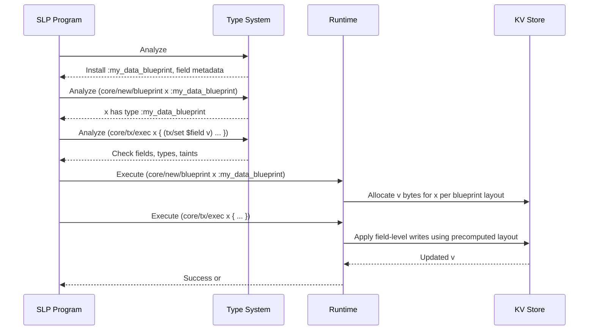

## Blueprint-Based Object Model

This document describes the **blueprint** layer: a type-level mechanism for defining structured objects that live in the KV store, without ever hydrating them into SLP objects. Blueprints integrate with the type system, taints, and the transaction DSL to give statically checkable, schema-aware operations over opaque bytes.

### Goals

- **Schema as data**: Represent object “schemas” as SLP data (`#(...)` lists) that can be parsed, stored, and distributed like any other value.
- **First-class types**: Promote blueprints into proper type symbols (for example `:my_data_blueprint`, `#my_data_blueprint`) that participate in the type system alongside primitive types.
- **Typed transactions on opaque values**: Manipulate objects as **bytes in KV** via a transaction DSL, without constructing full SLP objects for instances.
- **Hot path without runtime type checks**: Use the type system to fully validate transactions and allow disabling of runtime type checks in hot paths.

---

## Blueprint Definitions

Blueprints are defined as **hash-lists** that are consumed by the type system and not executed directly at runtime:

```slp
#(blueprint my_data_blueprint
    some_member_symbol :int 0
    some_other_symbol :str ""
)
```

Conceptually:

- Define a blueprint named `my_data_blueprint`.
- Fields:
  - `some_member_symbol` of type `:int` with default `0`.
  - `some_other_symbol` of type `:str` with default `""`.

During type system processing:

- The `#(blueprint ...)` form is **consumed** and used to:
  - Create a new type symbol `:my_data_blueprint`.
  - Optionally create the tainted variant `#my_data_blueprint`.
  - Register field metadata: names, types, defaults, and layout.

Blueprints are stored (for example under a root path) and auto-loaded into runtimes at startup, forming a shared, extensible type universe.

---

## Type Integration

Once a blueprint is defined:

- `:my_data_blueprint` is a **pure** type.
- `#my_data_blueprint` is its **tainted** counterpart.

The type system understands:

- Which fields exist in `:my_data_blueprint`.
- Each field’s type and default value.
- How to map symbolic field names to storage layout (byte offsets, encodings, and so on).

Blueprint types compose with the existing primitives:

- Primitive pure types: `:int`, `:real`, `:symbol`, `:str`, `:list-p`, `:list-c`, `:list-s`, `:some`, `:none`, `:error`.
- Primitive tainted types: `#int`, `#real`, `#symbol`, `#str`, `#list-p`, `#list-c`, `#list-s`, `#some`, `#none`, `#error`.
- Blueprint types: `:my_data_blueprint`, `#my_data_blueprint`, and so on.

---

## Constructing Blueprint Instances

A dedicated instruction constructs new instances from a blueprint type:

```slp
(core/new/blueprint x :my_data_blueprint)
```

Semantics:

- **Type system**:
  - Validates that `:my_data_blueprint` is a known blueprint type.
  - Associates `x` with the blueprint in the analysis context.
  - May insert blueprint metadata into the SLP object representing this call.

- **Runtime**:
  - Allocates and initializes a value for `x` in the KV store (or similar backing) according to the blueprint’s layout and defaults.
  - Does **not** create an SLP object representing the instance; the instance remains an opaque byte blob described by the blueprint.

`x` is effectively a handle to a KV-backed value of type `:my_data_blueprint`.

---

## Transactions on Blueprint Instances

Modification of instances is done via a **transaction DSL** that operates at the “value v” level in the KV store:

```slp
(core/util/insist
  (core/tx/exec x {
      (tx/set $some_member_symbol 42)
      (tx/set $some_other_symbol "billy")
  }))
```

Key points:

- `x` is known (by the type system) to be `:my_data_blueprint`.
- Inside `core/tx/exec`, field names are injected as `$`-variables:
  - `$some_member_symbol`
  - `$some_other_symbol`
- These `$`-variables are **field bindings** derived from the blueprint, not regular KV symbols.

### Type System Behavior

For the `core/tx/exec` body:

- **Field resolution**:
  - `$some_member_symbol` must correspond to a field of `my_data_blueprint`.
  - Any unknown `$field` in the body is a type error.

- **Type checking**:
  - The assigned value must match the field’s declared type.
  - In the example:
    - `42` must be `:int` for `some_member_symbol`.
    - `"billy"` must be `:str` for `some_other_symbol`.

- **Global guarantees**:
  - The entire transaction body can be validated before runtime execution.
  - Under strict configuration this allows erasing many runtime checks and honoring `core/util/insist` as “this cannot fail for type reasons.”

### Runtime Behavior

At runtime, `core/tx/exec`:

- Treats `x` as an opaque byte buffer in KV.
- Applies the transaction as a sequence of field operations:
  - Each `tx/set $field value` is compiled to a specific offset/encoding write.
- Does **not** hydrate the object into SLP:
  - No SLP tree for the instance is ever constructed.
  - The SLP program is only the **contract** describing how to update the bytes.

This matches the overall immutability and buffer model: SLP objects remain immutable command/data structures, while blueprint instances are managed as structured binary values, updated transactionally.

---

## Storage Semantics and Data Flow

### High-Level Flow

```mermaid
flowchart TD
    BP[#(blueprint ...)]
    TS[Type System<br/>+ TS Pass]
    CMD[(SLP Command)]
    NEW[(core/new/blueprint)]
    TX[(core/tx/exec)]
    KV[(KV Store)]
    V[[Value v (bytes)]]

    BP --> TS
    TS -->|registers type & layout| CMD

    CMD --> NEW
    NEW -->|allocate & init| KV
    KV -->|instance of :blueprint| V

    CMD --> TX
    TX -->|typed field ops| KV
    KV -->|updated v| V
```

- `#(blueprint ...)` is consumed by the type system to produce:
  - A type symbol.
  - Layout and field metadata.
- `core/new/blueprint` allocates KV-backed bytes for an instance.
- `core/tx/exec` applies a statically checked transaction plan to the instance bytes.

### Transaction Execution Detail



---

## Taints and Insistence

Blueprint types follow the same taint model as primitives:

- `:my_data_blueprint` is a pure instance, fully validated by the blueprint and type system.
- `#my_data_blueprint` is a tainted instance (for example containing fields derived from tainted inputs or uncertain IO).

Interaction points:

- Blueprint fields can be pure or tainted types (`:int` vs `#int`, and so on).
- A transaction body may:
  - Propagate taints (writing a `#int` into a field).
  - Produce a pure instance (for example constructing from fully validated pure inputs).
- `core/util/insist` around a `core/tx/exec` can be configured so that:
  - All type and shape errors are already impossible after the type system pass.
  - Any remaining failure is a true system or `#error` condition.

This allows configurations where type checks are disabled in hot paths, while still guaranteeing that no ill-typed data is ever processed by the runtime.

---

## Summary

- **Blueprints** are hash-list SLP forms that define object schemas and promote to first-class types.
- **Instances** of blueprint types live as opaque, KV-backed byte buffers; they are never hydrated into SLP objects.
- A **transaction DSL** (`core/tx/exec` and `tx/set`) provides schema-aware, statically checkable operations on these values.
- The **type system** uses blueprint metadata to validate construction and transactions, enabling configurations where runtime type checks can be aggressively minimized without sacrificing safety.


