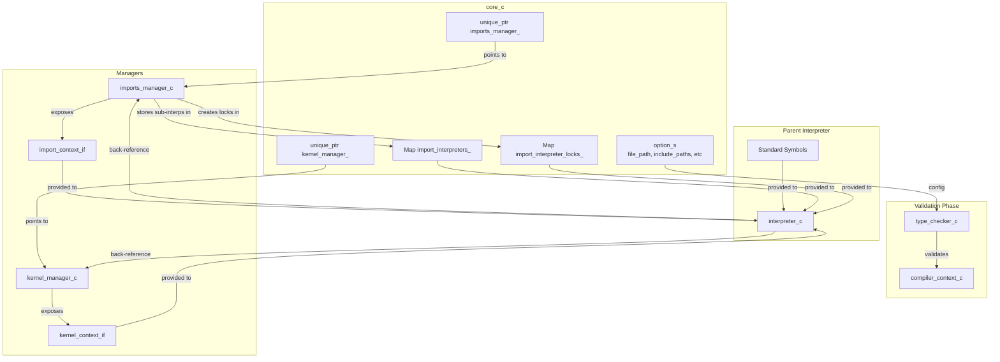
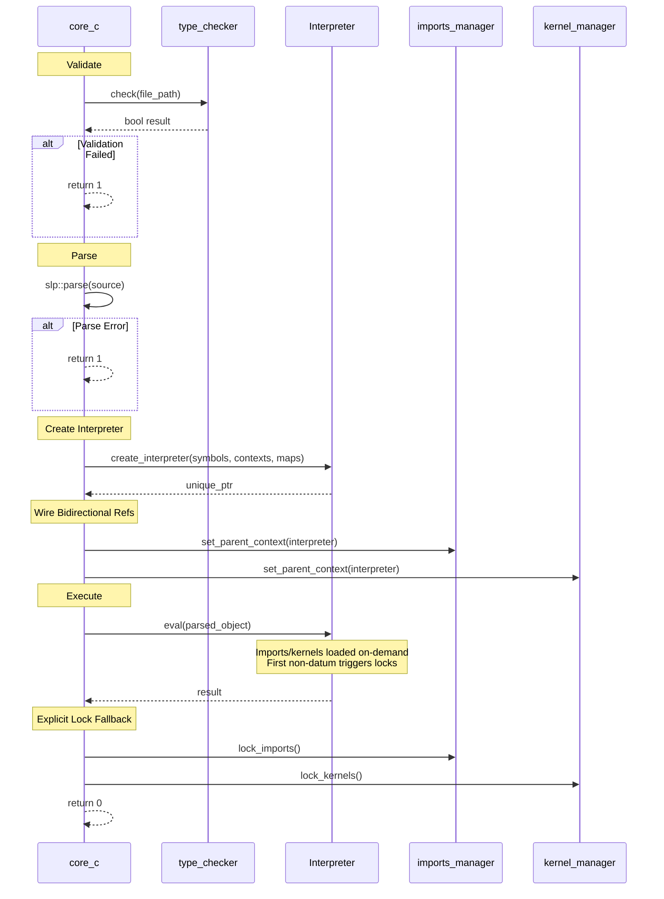

# SXS Core Runtime Orchestrator

`Note`: I had an AI generate this (GPT5.1) then I had another AI (sonnet 4.5) validate it, then I validated it. It appeard correct.

## Overview

The SXS core (`core_c`) is the top-level orchestrator responsible for coordinating the entire runtime system. It creates and manages the imports subsystem, kernels subsystem, type checking, parsing, and primary interpreter execution. The core enforces a strict initialization sequence, manages bidirectional context wiring, and implements a two-phase locking protocol to ensure safe and predictable program execution.

### Core Responsibilities

- **Manager Lifecycle**: Create and own imports_manager and kernel_manager
- **Storage Ownership**: Maintain shared maps for sub-interpreters and their locks
- **Context Wiring**: Connect bidirectional references between managers and interpreter
- **Type Checking**: Run pre-execution validation before runtime begins
- **Interpreter Creation**: Instantiate parent interpreter with appropriate contexts
- **Execution Control**: Parse, validate, and execute the main program file
- **Locking Protocol**: Enforce two-phase initialization (load → lock → execute)
- **Error Handling**: Coordinate error propagation and cleanup across subsystems

## Core Architecture



## Execution Sequence (core_c::run)



## Component Management

### Manager Creation (core_c constructor)

**imports_manager_c:**
```cpp
imports_manager_ = std::make_unique<imports::imports_manager_c>(
    logger->clone("imports"), include_paths, working_directory,
    &import_interpreters_, &import_interpreter_locks_);
```
Receives pointers to core-owned maps; will populate during attempt_import.

**kernel_manager_c:**
```cpp
kernel_manager_ = std::make_unique<kernels::kernel_manager_c>(
    logger->clone("kernels"), include_paths, working_directory);
```
Owns dylib handles and registered_functions_; calls kernel_shutdown on destruction.

### Interpreter Creation (core_c::run)

```cpp
auto interpreter = create_interpreter(
    standard_callable_symbols,
    &imports_manager_->get_import_context(),
    &kernel_manager_->get_kernel_context(),
    &import_interpreters_, &import_interpreter_locks_);
```
Created after managers; receives context interfaces and pointers to core-owned maps.

### Bidirectional Wiring

```cpp
imports_manager_->set_parent_context(interpreter.get());
kernel_manager_->set_parent_context(interpreter.get());
```

**Forward (Interpreter → Managers):** Via context interfaces for triggering imports/loads during eval.

**Backward (Managers → Interpreter):** Via parent_context pointer for creating sub-interpreters and accessing kernel context during import execution.

## Locking Protocol

### Two-Phase Initialization

The runtime enforces strict separation between structural loading and computation:

**Phase 1: Structural Loading (Unlocked)**
- Type checking validates main file (managers exist but unused)
- Main file parsed
- Parent interpreter created with manager contexts
- Bidirectional references wired

**Phase 2: Dynamic Loading During Eval (Unlocked)**
- interpreter->eval(parsed_object) begins execution
- Datum expressions `#(import ...)` and `#(load ...)` trigger on-demand loading
- Sub-interpreters created for imports via imports_manager_
- Dylibs opened for kernels via kernel_manager_
- Remains unlocked while only datum expressions execute

**Lock Trigger:**
- First **non-datum** expression in a BRACKET_LIST
- interpreter_c sets imports_locks_triggered_ = true
- Calls import_context_->lock() and kernel_context_->lock()
- Both managers set their locked flags simultaneously

**Phase 3: Locked Execution**
- All structural changes complete
- Pure computation proceeds
- Post-lock import/load attempts log error and return false

### Lock Trigger Implementation

In interpreter_c::eval for BRACKET_LIST:
```
for each element in bracket list:
  if !imports_locks_triggered_ && elem.type() != DATUM:
    trigger_import_locks()  // calls both context lock() methods
    imports_locks_triggered_ = true
  result = eval(elem)
```

**Enforcement in Managers:**
- imports_manager_c::attempt_import checks imports_locked_, logs error and returns false if locked
- kernel_manager_c::attempt_load checks kernels_locked_, logs error and returns false if locked
- Only circular imports throw exceptions; post-lock attempts fail gracefully

### Explicit Lock Fallback

After interpreter->eval completes, core_c::run calls:
```
imports_manager_->lock_imports();
kernel_manager_->lock_kernels();
```

Ensures locks engaged even if program contains no non-datum expressions.

## Storage Ownership

### Core-Owned Maps

**import_interpreters_**: Maps import symbol → sub-interpreter (unique_ptr<callable_context_if>)
- Populated by imports_manager during attempt_import
- Accessed by parent interpreter for cross-context calls

**import_interpreter_locks_**: Maps import symbol → shared_mutex
- Created by imports_manager during attempt_import
- Used by parent interpreter for thread-safe cross-context calls

### Manager-Owned State

**imports_manager_c:**
- imported_files_, currently_importing_, import_stack_ (circular detection)
- current_exports_ (temporary during import execution)
- import_context_c (interface to parent interpreter)

**kernel_manager_c:**
- loaded_kernels_, loaded_dylibs_, kernel_on_exit_fns_
- registered_functions_ (kernel_name/function_name → callable_symbol_s)
- api_table_ (callbacks for kernel_init)
- kernel_context_c (interface to parent interpreter)

### Interpreter State

**Parent interpreter_c:**
- scopes_, lambda_definitions_, loop_contexts_
- imports_locks_triggered_ flag
- Pointers to core-owned maps and manager contexts

**Sub-interpreters (in import_interpreters_ map):**
- Own scope stacks and lambda definitions for imported files

## Error Handling

### Validation Failures

**Type Checking:**
- Runs before parent interpreter created and before any imports/kernels loaded
- Managers and storage maps already exist but are unused
- Failures return error code 1
- Clean early exit via RAII

**Parse Errors:**
- Detected before interpreter creation
- Managers exist but unused
- Clean destruction via RAII
- Return error code 1

### Runtime Failures

**Import Errors:**
- Circular imports throw runtime_error with full import stack trace
- Import guard ensures cleanup via RAII
- Partial import state cleaned automatically
- Exception propagates to core, caught in run(), returns 1
- Post-lock import attempts log error and return false (no exception)

**Kernel Load Errors:**
- Dylib not found or invalid
- Errors logged and attempt_load returns false
- No exception throwing
- Post-lock load attempts log error and return false
- Controlled failure path

### Exception Handling

**Top-Level Catch:**
```
try {
  // All execution
} catch (const std::exception &e) {
  logger->error("Exception during execution: {}", e.what());
  return 1;
}
```

**Ensures:**
- No uncaught exceptions escape
- All errors logged
- Clean error codes returned
- RAII cleanup occurs

## Lifecycle Management

### Construction Order (core_c constructor)

1. Validate options (logger, file_path, file exists)
2. Create imports_manager_ (receives pointers to core-owned maps)
3. Create kernel_manager_
4. Storage maps (import_interpreters_, import_interpreter_locks_) exist as members

### Execution Order (core_c::run)

1. Create type_checker_c and run validation (managers exist but unused)
2. Parse main file via slp::parse
3. Create parent interpreter with standard symbols and manager contexts
4. Wire bidirectional references (set_parent_context on both managers)
5. Execute program via interpreter->eval (loads imports/kernels dynamically)
6. Explicitly lock both subsystems (lock_imports, lock_kernels)
7. Return 0 on success, 1 on error

### Destruction Order (automatic, reverse member declaration in core.hpp)

1. kernel_manager_ unique_ptr destroyed
   - Calls kernel_shutdown for each loaded kernel
   - Closes all dylib handles via dlclose
2. imports_manager_ unique_ptr destroyed
   - Releases import_context_c
3. import_interpreters_ map destroyed
   - Sub-interpreters destroyed
4. import_interpreter_locks_ map destroyed
   - Mutexes released

Local interpreter unique_ptr in run() is destroyed before core_c members.

## System Guarantees

- Managers created before interpreter
- Type checking runs before interpreter creation
- Bidirectional wiring complete before eval
- Imports/kernels loaded on-demand during eval
- Locks triggered automatically on first non-datum in bracket list
- Post-lock import/load attempts fail with logged error
- Cleanup via RAII in reverse member order
- kernel_shutdown called for all loaded kernels
- All dylibs closed before exit


## Design Rationale

**Core owns import storage maps:** Avoids circular dependencies (managers can't own what they populate for the interpreter that they need a reference to). Clear lifetime: maps destroyed before managers.

**Bidirectional wiring:** Interpreter needs manager contexts to trigger loads; managers need parent interpreter to create sub-interpreters. Solved by forward refs during construction, backward refs set after.

**Two-phase locking:** Structural loading (imports/kernels) must complete before computation. Datum expressions load structure; first non-datum triggers lock. Prevents dynamic loading during computation.
