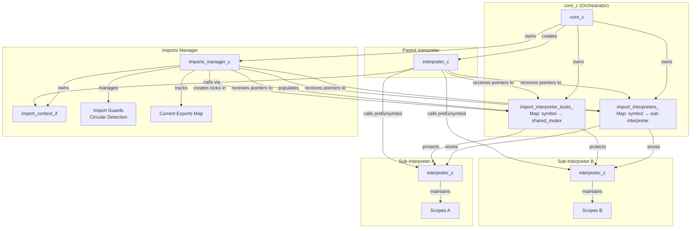
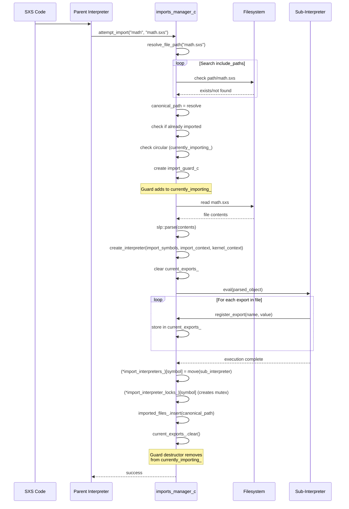

# SXS Imports System

## Overview

The SXS imports system provides a module architecture enabling code reuse and namespace isolation through isolated **sub-interpreters**. Each imported file executes in its own dedicated interpreter instance that persists for the program lifetime, allowing exports to be accessed repeatedly without re-execution. This design ensures complete isolation while enabling controlled cross-context communication through a symbol prefixing mechanism.

**Note:** This document describes the runtime imports system. Type checking for imports occurs separately through the compiler context which validates import statements and exported symbols without creating sub-interpreters.

### Key Design Principles

- **Isolated Execution**: Each import runs in a dedicated sub-interpreter with its own scope and state
- **Persistent Interpreters**: Sub-interpreters remain alive for program lifetime, not destroyed after first import
- **Symbol Prefixing**: Imported symbols accessed via `prefix/symbol` notation preventing namespace collisions
- **Circular Detection**: Import guards track currently-loading files to detect and prevent circular dependencies
- **Export Model**: Files explicitly export symbols; only exported values accessible to importers
- **Lazy Loading**: Imports loaded on-demand when first referenced, not at program start
- **Thread Safety**: Shared mutex locks enable concurrent read access to import interpreters
- **Lifecycle Control**: Imports locked after initialization phase, preventing dynamic imports during execution

### Type Checking vs Runtime Loading

**Important Architectural Separation:**

The imports system documented here handles **runtime loading and execution only**. Type checking for imports is performed separately by the compiler context during the validation phase.

**Type Checking Phase:**
- Performed by `compiler_context_c` during validation
- Validates import statements and resolves file paths
- Checks that imported symbols are exported
- Validates type compatibility of imported functions
- Does NOT create sub-interpreters or execute import files
- Used by standalone type checker and pre-execution validation

**Runtime Loading Phase (This System):**
- Performed by `imports_manager_c::attempt_import()`
- Creates isolated sub-interpreter for each import
- Executes import file to populate exports
- Registers export symbols with parent context
- Maintains interpreter and lock storage
- Only happens during program execution

**Why Separate?**
- Type checking validates imports without execution overhead
- Faster validation without interpreter creation
- Security: validate untrusted code without execution
- Supports ahead-of-time validation workflows
- Enables separate compilation and validation phases

## Architecture



**Note:** This diagram shows the runtime imports system. Type checking occurs separately and validates import relationships without creating these runtime structures.

## Core Components

### imports_manager_c

Central orchestrator managing the **runtime** imports subsystem lifecycle.

**Responsibilities:**
- File path resolution across include directories
- Sub-interpreter creation and storage management
- Circular import detection via import guards
- Export registration during import execution
- **Runtime** import locking and lifecycle control

**Does NOT handle:**
- Type checking or validation (see `compiler_context_c`)
- Compile-time symbol validation
- Import statement parsing for type safety

**Key State:**
- `include_paths_`: Search paths for import file discovery
- `imported_files_`: Set of successfully loaded canonical file paths
- `currently_importing_`: Set tracking files actively being imported (circular detection)
- `import_stack_`: Stack of import chain for error reporting
- `current_exports_`: Temporary storage for exports during import execution
- `imports_locked_`: Flag preventing further imports after initialization
- `parent_context_`: Pointer to parent interpreter for bidirectional communication
- `import_interpreters_`: Pointer to core-owned map of sub-interpreters
- `import_interpreter_locks_`: Pointer to core-owned map of shared mutexes

### import_context_if

Interface exposing import operations to the interpreter and datum instructions.

**Operations:**
- `is_import_allowed()`: Check if imports can still be performed
- `attempt_import(symbol, file_path)`: Trigger import file loading and sub-interpreter creation
- `register_export(name, value)`: Register an exported symbol during import execution
- `lock()`: Prevent further imports

### Sub-Interpreter Lifecycle

Each import file receives its own dedicated interpreter instance:

**Creation:**
- Triggered by first `#(import symbol "file.sxs")` statement
- New `interpreter_c` instance created with standard callable symbols
- Sub-interpreter receives import_context_if and kernel_context_if pointers
- Does NOT receive pointers to storage maps (only parent interpreter has those)
- File parsed and executed in sub-interpreter's isolated scope

**Lifetime:**
- Sub-interpreter persists for entire program execution
- Never destroyed or garbage collected
- Exports remain accessible indefinitely
- State maintained across multiple cross-context calls

**Isolation:**
- Own scope stack independent of parent
- Own lambda definitions registry
- Own symbol table
- Receives import_context_if pointer (can import other files)
- Receives kernel_context_if pointer (read-only kernel function access)
- Does NOT receive storage map pointers (cannot directly access other imports)

### Import Guards

RAII guards preventing circular import cycles:

**Mechanism:**
- `import_guard_c` inserted into `currently_importing_` set on import start
- Guard automatically removed from set on scope exit (success or exception)
- Import stack maintained for detailed error reporting

**Circular Detection:**
- Before importing, check if canonical path already in `currently_importing_`
- If present, circular dependency detected
- Error message includes full import chain showing cycle

## Import Lifecycle



### Path Resolution Algorithm

1. Check if `file_path` is absolute → use directly if exists
2. Search each path in `include_paths_` for `path/file_path`
3. Search `working_directory_/file_path`
4. Return empty string if not found
5. Resolve to canonical path to prevent duplicate imports of same file

## Cross-Context Communication

### Symbol Resolution

Imported symbols accessed using slash notation: `import_name/symbol_name`

**Resolution Process:**
1. Parent interpreter encounters symbol with `/` character
2. Extract prefix (import name) and suffix (symbol name)
3. Lookup prefix in `import_interpreters_` map
4. If found, acquire shared lock on corresponding mutex
5. Construct call in sub-interpreter context
6. Marshal arguments from parent to sub-interpreter
7. Execute in sub-interpreter
8. Return result to parent context

### Call Marshaling

When calling imported functions, arguments marshaled between contexts:

**Supported Argument Types:**
- Integers: Direct value passing
- Reals: Direct value passing
- Symbols: String representation passing
- Strings: String representation passing
- Lists: Not directly supported (requires serialization)

**Process:**
- Parent evaluates all arguments
- Constructs SXS code string: `(function_name arg1 arg2 ...)`
- Parses string into SLP object
- Acquires shared lock on sub-interpreter
- Calls `sub_interpreter->eval(call_obj)`
- Returns result object to parent

### Thread Safety

**Shared Mutex Locking:**
- Each sub-interpreter has associated `std::shared_mutex`
- Multiple readers (parent calls) can execute concurrently
- Single writer would block (not currently used)
- Lock acquired on every cross-context call
- RAII lock guard ensures proper release

**Concurrent Access:**
- Safe for parent to call same import from multiple places
- Safe for multiple imports to be called concurrently
- Sub-interpreters are read-only after import execution completes
- No mutation of sub-interpreter state after initialization

## Export/Import Model

### Export Registration

Files use `export` statement to publish symbols:

**During Import Execution:**
1. Sub-interpreter evaluates file contents
2. `export` calls invoke `import_context->register_export(name, value)`
3. Manager stores value in temporary `current_exports_` map
4. After execution, exports become accessible to parent

**Export Storage:**
- Values stored as SLP objects in sub-interpreter's scope
- Parent accesses via cross-context calls
- Exports persist for program lifetime
- current_exports_ temporarily tracks exports during import execution, then cleared

### Import Access

Parent code accesses imports through prefixed symbols:

**Mechanics:**
- Interpreter detects `/` in symbol name
- Treats prefix as import name, suffix as symbol to evaluate
- Lookup in sub-interpreter context
- Result returned to parent

**No Direct Symbol Import:**
- Cannot import symbol directly into parent scope
- Always accessed via prefix/suffix notation
- Enforces explicit namespace boundaries
- Prevents naming conflicts

## Locking and Isolation

### Import Locking

Imports can only occur during initialization phase:

**Lock Trigger:**
- Parent interpreter tracks first non-datum expression in bracket list
- On first regular code execution, locks triggered
- Both import and kernel contexts locked simultaneously
- Prevents dynamic imports during runtime

**Rationale:**
- All imports must be known before execution begins
- Enables static analysis of import graph
- Prevents race conditions in import loading
- Aligns with type checking expectations

### Scope Isolation

Each sub-interpreter maintains complete scope isolation:

**Isolated State:**
- Independent scope stack
- Own symbol definitions
- Own lambda definitions
- Own loop contexts
- Own execution state

**Shared Access:**
- Kernel context (read-only kernel functions)
- Import context (can import other files)

**Own Copy:**
- Type symbol map (built-in types, initialized per interpreter)

## Memory Model

### Persistent Interpreters

**Lifetime Management:**
- Sub-interpreters created on first import
- Stored in core-owned `import_interpreters_` map
- Never destroyed until program termination
- Memory overhead: one interpreter per import file

**SLP Object Sharing:**
- SLP objects use shared buffer design
- Passing object between contexts copies pointers, not data
- Export values safely shared via SLP object semantics
- No deep copying required for cross-context communication

### Storage Ownership

**core_c Owns:**
- `import_interpreters_` map: symbol → unique_ptr<callable_context_if>
- `import_interpreter_locks_` map: symbol → shared_mutex

**imports_manager_c Owns:**
- import_context_c implementation
- Temporary state during imports (current_exports_)
- Path resolution logic
- Import tracking sets (imported_files_, currently_importing_, import_stack_)

**Parent interpreter_c:**
- Receives pointers to core-owned maps
- Scope stack, lambda definitions, execution state

**Sub-interpreters (interpreter_c instances in map):**
- Own scope stack
- Own lambda definitions
- Own symbol values
- Own execution state

## Circular Import Detection

### Detection Mechanism

**Three-Level Tracking:**
1. `imported_files_`: Set of completed imports (canonical paths)
2. `currently_importing_`: Set of imports in progress (circular detection)
3. `import_stack_`: Vector showing full import chain (error reporting)

**Detection Process:**
- Before import, check if canonical_path in `currently_importing_`
- If present, circular dependency exists
- Generate detailed error showing full cycle
- Throw runtime_error with import chain

**Error Format:**
```
Circular import detected:
  /path/fileA.sxs imports
  /path/fileB.sxs imports
  /path/fileC.sxs imports
  /path/fileA.sxs (cycle detected)
```

### Import Guard RAII

**Automatic Cleanup:**
- `import_guard_c` constructor inserts into `currently_importing_`
- Destructor removes from set (even on exception)
- Stack unwinding ensures cleanup
- Import stack automatically maintained

**Exception Safety:**
- Guard ensures cleanup on import failure
- Partial import state cleaned up
- Next import attempt starts fresh
- No lingering state from failed imports

## System Limitations

1. **No Dynamic Imports**: Imports locked after initialization, cannot load new files at runtime
2. **Argument Marshaling**: Limited type support for cross-context calls (primitives only)
3. **Memory Persistence**: All sub-interpreters kept alive indefinitely
4. **No Unloading**: Once imported, file remains loaded for program lifetime
5. **Single Import per File**: Same file can only be imported once (by canonical path)
6. **No Nested Exports**: Exports are flat namespace, no hierarchical structure

## Comparison to Kernels

### Similarities

- Both provide isolation (sub-interpreters vs dylibs)
- Both locked after initialization phase
- Both use context interfaces for access
- Both managed by dedicated manager classes

### Differences

| Aspect | Imports | Kernels |
|--------|---------|---------|
| Isolation | Sub-interpreters | Shared libraries |
| Language | SXS code | C++ native |
| Performance | Interpreted | Compiled native |
| Lifecycle | Interpreter per file | Dylib per kernel |
| Access | Cross-context calls | Direct function calls |
| State | Full interpreter state | Global/static storage |
| Threading | Shared mutex | No special locking |

## Design Rationale

### Why Sub-Interpreters?

**Isolation Benefits:**
- Complete scope separation prevents naming conflicts
- Independent execution state per module
- No accidental symbol pollution
- Clean module boundaries

**Persistence Benefits:**
- Exports accessible without re-execution
- Amortize parse/execute cost
- Consistent results across calls
- State preservation if needed

### Why Not Shared Scope?

**Rejected Alternatives:**
1. **Flat Import**: Copy exports into parent scope
   - Problem: Naming conflicts, no clear boundaries
2. **Single Shared Interpreter**: All imports in one scope
   - Problem: No isolation, global pollution
3. **Re-execute on Access**: Parse/execute each time
   - Problem: Performance overhead, inconsistent state

### Why Symbol Prefixing?

**Benefits:**
- Explicit namespace boundaries
- No automatic symbol merging
- Clear import source in code
- Prevents accidental collisions
- Enables multiple imports with same export names
