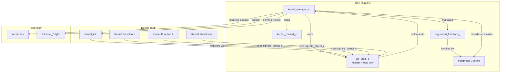
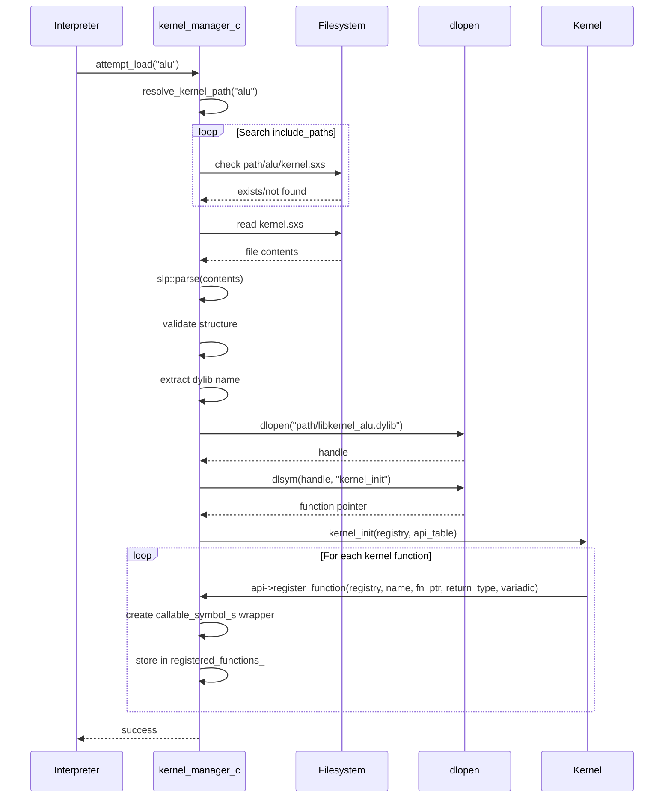
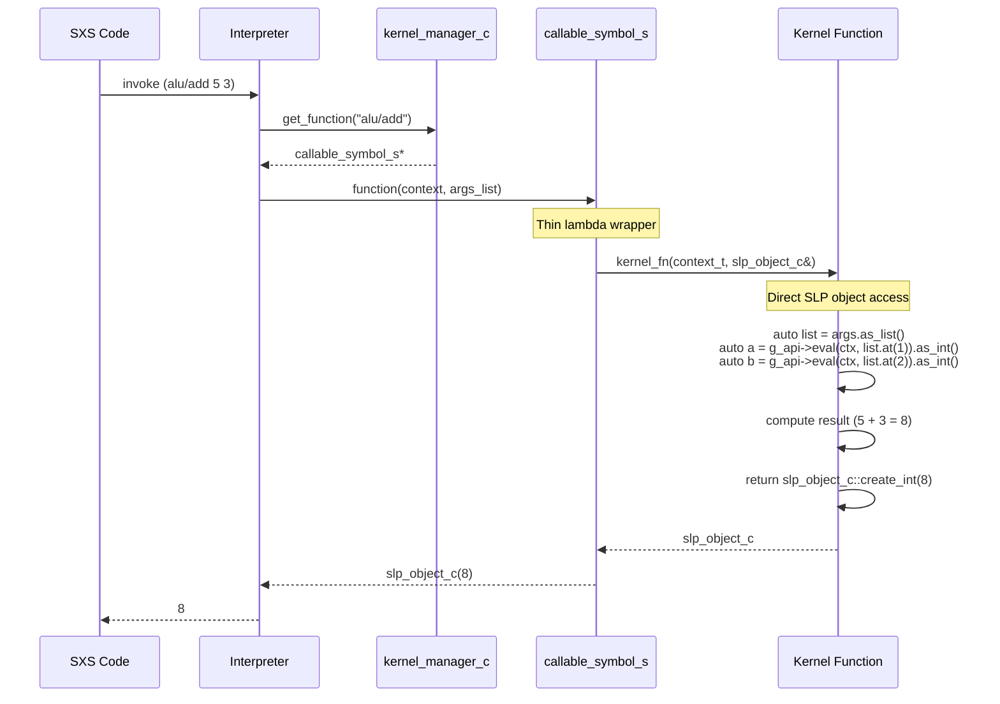

# SXS Kernel System

## Overview

The SXS kernel system provides a C++ plugin architecture for extending the language runtime with native compiled functions. Kernels are dynamically loaded shared libraries that register functions callable from SXS code, enabling high-performance operations while maintaining type safety through direct integration with the SLP object system.

### Key Design Principles

- **Native C++ Integration**: Direct use of `slp::slp_object_c` eliminates marshaling overhead
- **Stack-Based Objects**: Move semantics and value passing prevent memory leaks
- **Minimal API Surface**: Only `register_function` and `eval` in the API table
- **Type Safety**: Compile-time type checking through C++ type system
- **Dynamic Loading**: Kernels loaded on-demand, locked after initialization phase
- **Isolation**: Kernels execute in separate compilation units with controlled runtime access

## Architecture



## Core Components

### kernel_manager_c

Central orchestrator managing the entire kernel subsystem lifecycle.

**Responsibilities:**
- Path resolution across include directories
- Dynamic library loading and symbol resolution
- Function registration and lookup
- Lifecycle management (load → register → lock → execute)
- Minimal API table provisioning

**Key State:**
- `include_paths_`: Search paths for kernel discovery
- `loaded_kernels_`: Set of successfully loaded kernel names
- `loaded_dylibs_`: Handles for dlopen'd libraries
- `registered_functions_`: Map of `kernel_name/function_name` → callable_symbol_s
- `kernels_locked_`: Flag preventing further loads after initialization

### kernel_context_if

Interface exposing kernel operations to the interpreter.

**Operations:**
- `is_load_allowed()`: Check if kernels can still be loaded
- `attempt_load(name)`: Trigger kernel loading
- `lock()`: Prevent further kernel loads
- `has_function(name)`: Check function availability
- `get_function(name)`: Retrieve callable symbol

### api_table_s

Minimal API table providing essential runtime operations to kernels.

**Structure:**
```cpp
namespace pkg::kernel {
  struct api_table_s {
    register_fn_t register_function;
    eval_fn_t eval;
  };
}
```

All object creation is done via static methods on `slp::slp_object_c`.

## Kernel Lifecycle



### Path Resolution Algorithm

1. Check if `kernel_name` is absolute path → use directly
2. Search each path in `include_paths_` for `path/kernel_name/kernel.sxs`
3. Search `working_directory_/kernel_name/kernel.sxs`
4. Return empty string if not found

## Runtime Function Call Flow



## API Reference

### Registration

```cpp
void register_function(pkg::kernel::registry_t registry, 
                       const char *name,
                       pkg::kernel::kernel_fn_t function,
                       slp::slp_type_e return_type, 
                       int variadic)
```

Register a kernel function during `kernel_init`.

- `registry`: Opaque handle to registration context
- `name`: Function name (without kernel prefix)
- `function`: Function pointer with signature `slp::slp_object_c(context_t, const slp::slp_object_c&)`
- `return_type`: Expected return type from `slp::slp_type_e` enum
- `variadic`: Non-zero if function accepts variable arguments

### Evaluation

```cpp
slp::slp_object_c eval(pkg::kernel::context_t ctx, 
                       const slp::slp_object_c &obj)
```

Evaluate an SXS object in the current execution context.

- Returns: `slp::slp_object_c` by value (move semantics)

### SLP Object Methods

Kernels work directly with `slp::slp_object_c` objects:

**Type Inspection:**
```cpp
slp::slp_type_e type() const;
```

**Value Extraction:**
```cpp
std::int64_t as_int() const;
double as_real() const;
const char* as_symbol() const;
list_c as_list() const;
string_c as_string() const;
bool has_data() const;
```

**Static Factory Methods:**
```cpp
static slp_object_c create_int(long long value);
static slp_object_c create_real(double value);
static slp_object_c create_string(const std::string &value);
static slp_object_c create_symbol(const std::string &name);
static slp_object_c create_none();
static slp_object_c create_paren_list(const slp_object_c *objects, size_t count);
static slp_object_c create_bracket_list(const slp_object_c *objects, size_t count);
static slp_object_c create_brace_list(const slp_object_c *objects, size_t count);
```

**List Operations:**
```cpp
class list_c {
  size_t size() const;
  bool empty() const;
  slp_object_c at(size_t index) const;
};
```

## Kernel Implementation Guide

### Minimal Kernel Structure

**kernel.sxs**
```scheme
#(define-kernel example "libkernel_example.dylib" [
    (define-function greet (name :str) :str)
])
```

**example.cpp**
```cpp
#include <kernel_api.hpp>
#include <string>

static const pkg::kernel::api_table_s *g_api = nullptr;

static slp::slp_object_c kernel_greet(pkg::kernel::context_t ctx,
                                       const slp::slp_object_c &args) {
    auto list = args.as_list();
    
    auto name = g_api->eval(ctx, list.at(1)).as_string().to_string();
    
    std::string greeting = "Hello, " + name + "!";
    
    return slp::slp_object_c::create_string(greeting);
}

extern "C" {
    void kernel_init(pkg::kernel::registry_t registry, 
                     const pkg::kernel::api_table_s *api) {
        g_api = api;
        
        api->register_function(
            registry,
            "greet",
            kernel_greet,
            slp::slp_type_e::DQ_LIST,
            0
        );
    }
}
```

**Build**
```bash
g++ -std=c++17 -shared -fPIC -o libkernel_example.dylib example.cpp \
    -I/path/to/sxs/include -L/path/to/sxs/lib -lpkg_slp
```

### Realistic Example: ALU Kernel

**alu.cpp**
```cpp
#include <kernel_api.hpp>

static const pkg::kernel::api_table_s *g_api = nullptr;

static slp::slp_object_c alu_add(pkg::kernel::context_t ctx,
                                  const slp::slp_object_c &args) {
  auto list = args.as_list();
  if (list.size() < 3) {
    return slp::slp_object_c::create_int(0);
  }

  auto a = g_api->eval(ctx, list.at(1)).as_int();
  auto b = g_api->eval(ctx, list.at(2)).as_int();

  return slp::slp_object_c::create_int(a + b);
}

static slp::slp_object_c alu_div(pkg::kernel::context_t ctx,
                                  const slp::slp_object_c &args) {
  auto list = args.as_list();
  if (list.size() < 3) {
    return slp::slp_object_c::create_int(0);
  }

  auto a = g_api->eval(ctx, list.at(1)).as_int();
  auto b = g_api->eval(ctx, list.at(2)).as_int();

  if (b == 0) {
    return slp::slp_object_c::create_int(0);
  }

  return slp::slp_object_c::create_int(a / b);
}

extern "C" {
  void kernel_init(pkg::kernel::registry_t registry,
                   const pkg::kernel::api_table_s *api) {
    g_api = api;
    api->register_function(registry, "add", alu_add, slp::slp_type_e::INTEGER, 0);
    api->register_function(registry, "div", alu_div, slp::slp_type_e::INTEGER, 0);
  }
}
```

### Advanced Example: Error Handling

```cpp
#include <kernel_api.hpp>
#include <string>

static const pkg::kernel::api_table_s *g_api = nullptr;

static slp::slp_object_c create_error(const std::string &message) {
  std::string error_str = "@(" + message + ")";
  auto parse_result = slp::parse(error_str);
  return parse_result.take();
}

static slp::slp_object_c kv_set(pkg::kernel::context_t ctx,
                                 const slp::slp_object_c &args) {
  auto list = args.as_list();
  if (list.size() < 3) {
    return create_error("set requires 2 arguments");
  }

  auto key_obj = list.at(1);
  if (key_obj.type() != slp::slp_type_e::SYMBOL) {
    return create_error("set requires symbol key");
  }

  auto value = g_api->eval(ctx, list.at(2));
  
  bool success = store_value(key_obj.as_symbol(), value);
  
  return success ? slp::slp_object_c::create_int(0)
                 : create_error("set: failed to store value");
}
```

### Working with Lists

```cpp
static slp::slp_object_c process_list(pkg::kernel::context_t ctx,
                                       const slp::slp_object_c &args) {
  auto list = args.as_list();
  
  std::vector<slp::slp_object_c> processed;
  
  for (size_t i = 1; i < list.size(); i++) {
    auto elem = g_api->eval(ctx, list.at(i));
    if (elem.type() == slp::slp_type_e::INTEGER) {
      auto value = elem.as_int();
      processed.push_back(slp::slp_object_c::create_int(value * 2));
    }
  }
  
  return slp::slp_object_c::create_bracket_list(processed.data(), 
                                                 processed.size());
}
```

### Variadic Functions

```cpp
static slp::slp_object_c io_put(pkg::kernel::context_t ctx,
                                 const slp::slp_object_c &args) {
  auto list = args.as_list();
  if (list.size() < 2) {
    return slp::slp_object_c::create_int(-1);
  }

  auto format = g_api->eval(ctx, list.at(1)).as_string().to_string();
  
  for (size_t i = 2; i < list.size(); i++) {
    auto evaled = g_api->eval(ctx, list.at(i));
  }
  
  return slp::slp_object_c::create_int(output_length);
}

extern "C" {
  void kernel_init(pkg::kernel::registry_t registry,
                   const pkg::kernel::api_table_s *api) {
    g_api = api;
    api->register_function(registry, "put", io_put, 
                          slp::slp_type_e::INTEGER, 1);
  }
}
```

## Best Practices

### 1. Type Validation

Always check types before extraction:

```cpp
auto obj = g_api->eval(ctx, list.at(1));
if (obj.type() != slp::slp_type_e::INTEGER) {
    return create_error("expected integer");
}
auto value = obj.as_int();
```

### 2. Error Handling

Return error objects for failures:

```cpp
static slp::slp_object_c create_error(const std::string &msg) {
  std::string error_str = "@(" + msg + ")";
  auto parse_result = slp::parse(error_str);
  return parse_result.take();
}
```

### 3. String Handling

The `as_string()` method returns a lightweight view. Call `to_string()` to get `std::string`:

```cpp
auto str_obj = g_api->eval(ctx, list.at(1));
std::string value = str_obj.as_string().to_string();
```

### 4. List Iteration

`as_list()` returns a lightweight view, not a heap allocation:

```cpp
auto list = args.as_list();
for (size_t i = 1; i < list.size(); i++) {
    auto elem = list.at(i);
}
```

### 5. Move Semantics

Objects are returned by value using move semantics. No manual memory management:

```cpp
return slp::slp_object_c::create_int(result);
```

### 6. State Management and Cleanup

Use global or static storage for kernel state. If your kernel maintains global state, implement the **optional** `kernel_shutdown` function:

```cpp
static std::map<std::string, std::shared_ptr<DataStore>> g_stores;

extern "C" void kernel_shutdown(const pkg::kernel::api_table_s *api) {
  g_stores.clear();
}
```

**kernel_shutdown behavior:**
- **Optional**: Only needed if kernel has state to clean up
- **Automatic**: Called by `kernel_manager_c` destructor before dylib unload
- **Timing**: Invoked in reverse order of kernel loading
- **Not found**: If symbol doesn't exist via `dlsym`, it's silently skipped

Stateless kernels (like alu, io, random) don't need to define this function.

## Type System

### slp::slp_type_e Mapping

| SXS Type | slp_type_e | C++ Access |
|----------|------------|------------|
| None | NONE | `create_none()` |
| Some | SOME | `has_data()`, `get_data()` |
| Paren List | PAREN_LIST | `as_list()` |
| Brace List | BRACE_LIST | `as_list()` |
| Bracket List | BRACKET_LIST | `as_list()` |
| String | DQ_LIST | `as_string().to_string()` |
| Symbol | SYMBOL | `as_symbol()` |
| Rune | RUNE | - |
| Integer | INTEGER | `as_int()` |
| Real | REAL | `as_real()` |
| Error | ERROR | special form |
| Datum | DATUM | compile-time data |
| Aberrant | ABERRANT | lambda reference |

## kernel.sxs Metadata Format

```scheme
#(define-kernel <kernel-name> <dylib-filename> [
    (define-function <fn-name> (<arg> :<type> ...) :<return-type>)
    ...
])
```

**Example:**
```scheme
#(define-kernel alu "libkernel_alu.dylib" [
    (define-function add (a :int b :int) :int)
    (define-function mul (a :int b :int) :int)
    (define-function div (a :int b :int) :int)
])
```

The metadata declares expected functions. The manager verifies that all declared functions are registered during `kernel_init`.

## Standard Library Kernels

### alu - Arithmetic Operations

Integer and real arithmetic: `add`, `sub`, `mul`, `div`, `mod`, `add_r`, `sub_r`, `mul_r`, `div_r`

### io - Input/Output

Formatted output: `put` (variadic printf-style formatting)

### random - Random Generation

Random value generation: `int_range`, `real_range`, `string`, `string_alpha`

### kv - Key-Value Storage

Persistent and in-memory storage: `open-memory`, `open-disk`, `set`, `get`, `del`, `snx`, `cas`

### event - Event System

Pub/sub messaging: `subscribe`, `unsubscribe`, `publish`

## Performance Characteristics

### Zero-Copy Design

Objects are passed by reference and returned by value using move semantics. The SLP shared buffer design means copying an object only copies pointers to shared data, not the data itself.

### Factory Method Performance

Static factory methods use `slp::parse()` internally for consistency. For primitive types:
- `create_int/create_real`: Parse string representation (~100ns)
- `create_string`: Direct buffer construction (~50ns)
- `create_symbol`: Parse symbol string (~80ns)
- List creation: Build string, parse (~200ns + 50ns per element)

For performance-critical paths, consider batching object creation or caching results.

### Thread Safety

- API functions are thread-safe
- Kernel functions may be called concurrently - implement locking as needed
- `eval` acquires appropriate locks for cross-context calls

## System Limitations

1. **C++ Required**: Kernels must be C++17 or later
2. **Load Lock**: Once locked, no new kernels can be loaded
3. **Function Names**: Must be unique within kernel
4. **Platform**: Uses POSIX `dlopen` - macOS/Linux only
5. **No Exceptions**: Kernel exceptions should be caught and converted to error returns

## Memory Model

### Stack-Based Objects

All `slp::slp_object_c` instances are stack-allocated with automatic lifetime:

```cpp
slp::slp_object_c obj = g_api->eval(ctx, list.at(1));
auto value = obj.as_int();
```

No manual `delete` or `free` calls needed.

### Shared Data Buffers

SLP objects share underlying data buffers. Copying an object is cheap (copies pointers, not buffers):

```cpp
slp::slp_object_c obj1 = slp::slp_object_c::create_int(42);
slp::slp_object_c obj2 = obj1;  
```

Both `obj1` and `obj2` point to the same shared buffer.

### Move Semantics

Return values use move semantics to avoid copies:

```cpp
return slp::slp_object_c::create_int(result);
```

The object is moved directly to the caller's stack frame.

## Example: Complete Kernel Implementation

**libs/std/alu/alu.cpp** (actual production code):

```cpp
#include "alu.hpp"

static const struct pkg::kernel::api_table_s *g_api = nullptr;

static slp::slp_object_c alu_add(pkg::kernel::context_t ctx,
                                  const slp::slp_object_c &args) {
  auto list = args.as_list();
  if (list.size() < 3) {
    return slp::slp_object_c::create_int(0);
  }

  auto a = g_api->eval(ctx, list.at(1)).as_int();
  auto b = g_api->eval(ctx, list.at(2)).as_int();

  return slp::slp_object_c::create_int(a + b);
}

static slp::slp_object_c alu_mul(pkg::kernel::context_t ctx,
                                  const slp::slp_object_c &args) {
  auto list = args.as_list();
  if (list.size() < 3) {
    return slp::slp_object_c::create_int(0);
  }

  auto a = g_api->eval(ctx, list.at(1)).as_int();
  auto b = g_api->eval(ctx, list.at(2)).as_int();

  return slp::slp_object_c::create_int(a * b);
}

static slp::slp_object_c alu_add_r(pkg::kernel::context_t ctx,
                                    const slp::slp_object_c &args) {
  auto list = args.as_list();
  if (list.size() < 3) {
    return slp::slp_object_c::create_real(0.0);
  }

  auto a = g_api->eval(ctx, list.at(1)).as_real();
  auto b = g_api->eval(ctx, list.at(2)).as_real();

  return slp::slp_object_c::create_real(a + b);
}

extern "C" void kernel_init(pkg::kernel::registry_t registry,
                            const pkg::kernel::api_table_s *api) {
  g_api = api;
  api->register_function(registry, "add", alu_add, slp::slp_type_e::INTEGER, 0);
  api->register_function(registry, "mul", alu_mul, slp::slp_type_e::INTEGER, 0);
  api->register_function(registry, "add_r", alu_add_r, slp::slp_type_e::REAL, 0);
}
```

Clean, simple, no memory management required.

## Future Enhancements

1. **Async Functions**: Support for non-blocking kernel operations
2. **Hot Reload**: Dynamic kernel reloading during development
3. **Sandboxing**: Resource limits and capability-based security
4. **Error Propagation**: Rich error objects with stack traces
5. **JIT Compilation**: Runtime optimization of frequently-called paths
