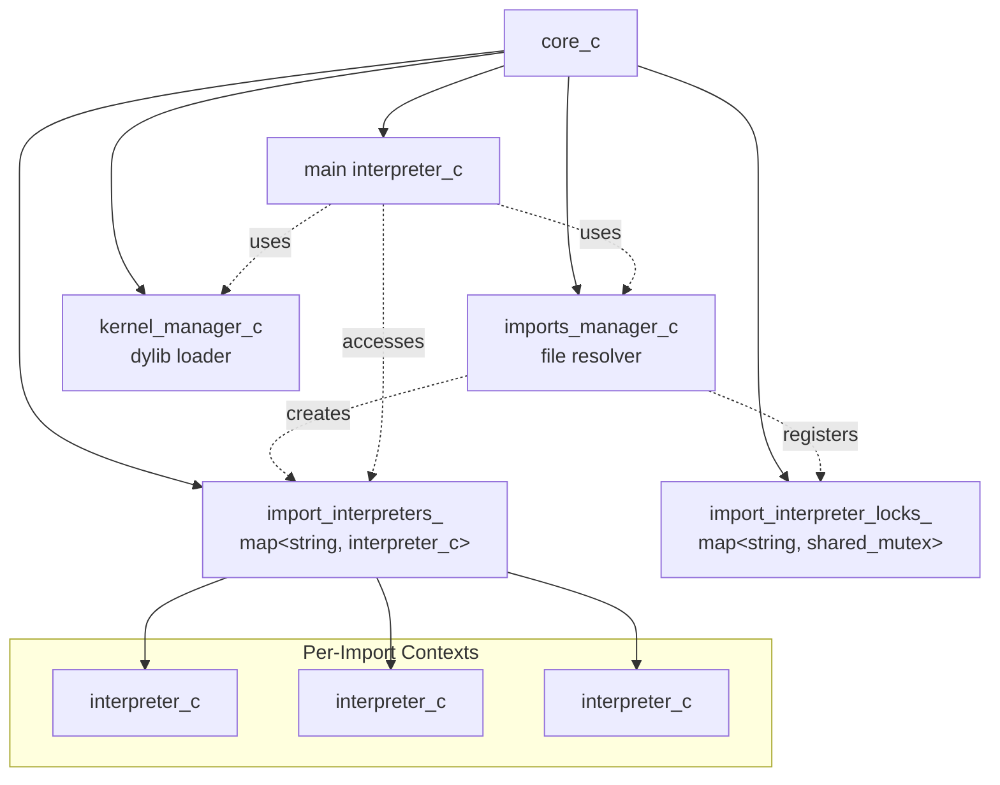

# System Overview

This document is mostly for me. As projects grow I find its always nice to have a 1000 ft view of the system. This usually takes place
as a loose markdown or some notes in a notebook but since I have a word printer (Claude) I figured I would write out the thing briefly
and have it cross over with the code to make a brief overview doc. 

## Architecture Diagram

## Core Components

**core_c** is the top-level orchestrator that owns all major subsystems. It creates and coordinates the imports_manager, kernel_manager, and the main interpreter. Core also owns two critical maps: import_interpreters_ which stores isolated interpreters for each imported file, and import_interpreter_locks_ which provides thread-safe access to those interpreters.

**interpreter_c** is the execution engine that evaluates SLP objects. It implements the callable_context_if interface and manages symbol scopes using a stack of maps, lambda definitions via an ID registry, and type mappings. The interpreter dispatches evaluation based on SLP object types and handles namespace resolution for cross-context calls using slash-delimited symbols (prefix/suffix).

**imports_manager_c** handles multi-file support by resolving import paths and creating isolated interpreters for each imported file. Each import gets its own dedicated interpreter stored in core's map under the import symbol name. The manager detects circular dependencies, manages the import stack, and coordinates cross-context symbol access. Import symbols become namespace prefixes allowing the main interpreter to call functions in imported contexts.

**kernel_manager_c** loads dynamic libraries and manages native function registration. Kernels are directories containing a kernel.sxs metadata file and a dylib. During initialization, the manager calls kernel_init in the dylib, passing a C API table. Kernels register functions via callbacks, and these functions are stored in a registry under kernel_name/function_name. The interpreter can then call these native functions as if they were built-in language features. Kernels may optionally define lifecycle hooks (on_init, on_exit) specified via define-ctor and define-dtor in kernel.sxs for automatic initialization and cleanup.

**instructions** are the built-in language functions like def, fn, if, match, try, recover, eval, apply, export, etc. These are provided by get_standard_callable_symbols() and passed to the interpreter at creation time. Instructions define the core language semantics.

## Execution Flow

Core initialization creates the imports_manager and kernel_manager in its constructor. The run() method then reads and parses the source file into SLP objects. The main interpreter is created with the standard instruction symbols and receives pointers to the import and kernel manager contexts.

During evaluation, the main interpreter processes SLP objects based on their type. When an import is encountered (via datum instruction), imports_manager resolves the file path, parses it, creates a new isolated interpreter with its own scope, and evaluates the imported file. The resulting interpreter is stored in core's import_interpreters_ map under the import symbol name, and a corresponding mutex is created for thread-safe access.

When a kernel load is encountered, kernel_manager searches for the kernel directory, parses the metadata file, dlopen()s the dylib, and calls kernel_init. The kernel registers its functions through the C API, and these functions are wrapped in callable_symbol_s lambdas stored in the registry. If the kernel defines lifecycle hooks via define-ctor/define-dtor, the on_init function is called immediately after kernel_init, and on_exit is registered for automatic cleanup before dylib unload.

Cross-context calls occur when the interpreter encounters a symbol with a slash delimiter. The prefix identifies the import context, and the suffix is the symbol to access in that context. For function calls, arguments are evaluated in the local context, serialized to an SLP string, parsed in the target context, and evaluated there. Return values are copied back.

A lock mechanism prevents imports and kernels from being loaded after the initialization phase completes. The lock is triggered when the interpreter evaluates the first non-datum element in a bracket list. This ensures all external dependencies are loaded before program logic executes.

Thread safety for imports is achieved through per-import mutexes stored in import_interpreter_locks_. When a cross-context call is made, the calling interpreter acquires a shared lock on the target import's mutex, allowing concurrent reads but serializing writes.

## Key Relationships

- core_c owns everything and coordinates lifecycle
- imports_manager creates and stores interpreters in core's map
- kernel_manager loads dylibs and registers functions
- Main interpreter delegates to imports_manager and kernel_manager contexts
- Import interpreters are isolated but share kernel and import contexts
- Cross-context communication happens via namespace prefixes and mutex synchronization
- Lock mechanism enforces initialization-time-only loading of external dependencies

