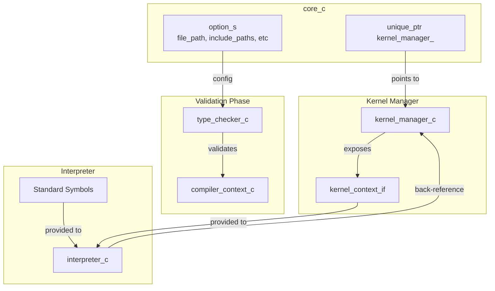
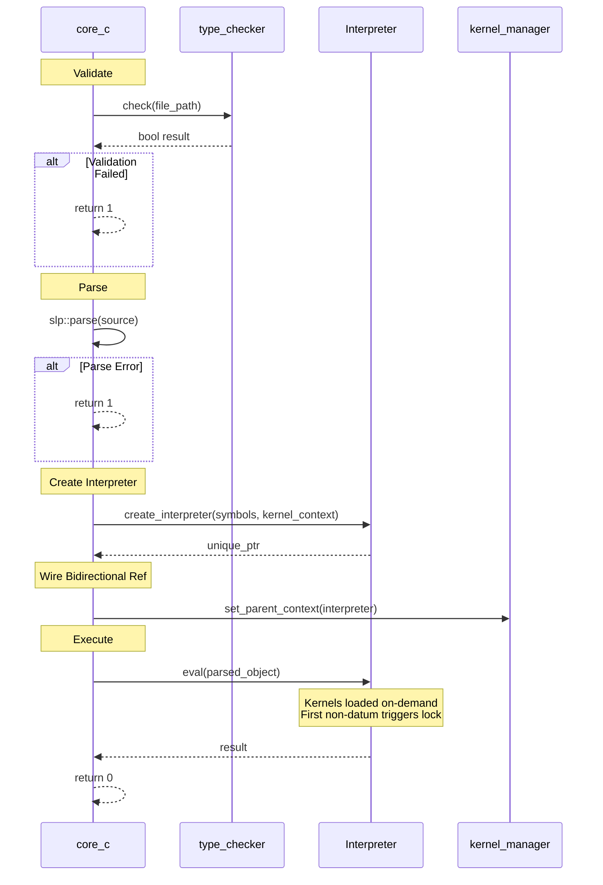

# SXS Core Runtime Orchestrator

## Overview

The SXS core (`core_c`) is the top-level orchestrator responsible for coordinating the entire runtime system. It creates and manages the kernels subsystem, type checking, parsing, and primary interpreter execution. The core enforces a strict initialization sequence and implements automatic kernel locking to ensure safe and predictable program execution.

### Core Responsibilities

- **Manager Lifecycle**: Create and own kernel_manager
- **Context Wiring**: Connect bidirectional references between kernel manager and interpreter
- **Type Checking**: Run pre-execution validation before runtime begins
- **Interpreter Creation**: Instantiate interpreter with appropriate kernel context
- **Execution Control**: Parse, validate, and execute the main program file
- **Locking Protocol**: Automatic kernel locking on first non-datum expression
- **Error Handling**: Coordinate error propagation and cleanup across subsystems

## Core Architecture



## Execution Sequence (core_c::run)



## Component Management

### Manager Creation (core_c constructor)

**kernel_manager_c:**
```cpp
kernel_manager_ = std::make_unique<kernels::kernel_manager_c>(
    logger->clone("kernels"), include_paths, working_directory);
```
Owns dylib handles and registered_functions_; calls kernel_shutdown on destruction.

### Interpreter Creation (core_c::run)

```cpp
auto interpreter = create_interpreter(
    standard_callable_symbols,
    &kernel_manager_->get_kernel_context());
```
Created after kernel manager; receives standard symbols and kernel context interface.

### Bidirectional Wiring

```cpp
kernel_manager_->set_parent_context(interpreter.get());
```

**Forward (Interpreter → Kernel Manager):** Via kernel context interface for triggering kernel loads during eval.

**Backward (Kernel Manager → Interpreter):** Via parent_context pointer for defining forms from kernel definitions.

## Locking Protocol

### Automatic Kernel Locking

The runtime enforces strict separation between kernel loading and computation:

**Phase 1: Structural Loading (Unlocked)**
- Type checking validates main file (kernel manager exists but unused)
- Main file parsed
- Interpreter created with kernel context
- Bidirectional reference wired

**Phase 2: Dynamic Loading During Eval (Unlocked)**
- interpreter->eval(parsed_object) begins execution
- Datum expressions `#(load ...)` trigger on-demand kernel loading
- Dylibs opened for kernels via kernel_manager_
- Remains unlocked while only datum expressions execute

**Lock Trigger:**
- First **non-datum** expression in a BRACKET_LIST
- interpreter_c sets kernels_locked_triggered_ = true
- Calls kernel_context_->lock()
- Kernel manager sets kernels_locked_ flag

**Phase 3: Locked Execution**
- All kernel loading complete
- Pure computation proceeds
- Post-lock load attempts throw exception

### Lock Trigger Implementation

In interpreter_c::eval for BRACKET_LIST:
```cpp
for each element in bracket list:
  if !kernels_locked_triggered_ && elem.type() != DATUM:
    trigger_kernel_lock()  // calls kernel_context_->lock()
    kernels_locked_triggered_ = true
  result = eval(elem)
```

**Enforcement in Kernel Manager:**
- kernel_manager_c::attempt_load checks kernels_locked_
- If locked, logs error and returns false
- interpret_datum_load throws exception: "kernel loading is locked (must occur at start of program)"

## Storage Ownership

### Manager-Owned State

**kernel_manager_c:**
- loaded_kernels_, loaded_dylibs_, kernel_on_exit_fns_
- registered_functions_ (kernel_name/function_name → callable_symbol_s)
- api_table_ (callbacks for kernel_init)
- kernel_context_c (interface to interpreter)
- kernels_locked_ flag

### Interpreter State

**interpreter_c:**
- scopes_, lambda_definitions_, loop_contexts_, form_definitions_
- Pointer to kernel context
- kernels_locked_triggered_ flag

## Error Handling

### Validation Failures

**Type Checking:**
- Runs before parent interpreter created and before any kernels loaded
- Managers and storage maps already exist but are unused
- Failures return error code 1
- Clean early exit via RAII

**Parse Errors:**
- Detected before interpreter creation
- Managers exist but unused
- Clean destruction via RAII
- Return error code 1

### Runtime Failures

**Kernel Load Errors:**
- Dylib not found or invalid
- Errors logged and attempt_load returns false
- Post-lock load attempts throw exception
- Controlled failure path with clear error messages

### Exception Handling

**Top-Level Catch:**
```
try {
  // All execution
} catch (const std::exception &e) {
  logger->error("Exception during execution: {}", e.what());
  return 1;
}
```

**Ensures:**
- No uncaught exceptions escape
- All errors logged
- Clean error codes returned
- RAII cleanup occurs

## Lifecycle Management

### Execution Order (core_c::run)

1. Create type_checker_c and run validation (kernel manager exists but unused)
2. Parse main file via slp::parse
3. Create interpreter with standard symbols and kernel context
4. Wire bidirectional reference (set_parent_context on kernel manager)
5. Execute program via interpreter->eval (loads kernels dynamically, auto-locks on first non-datum)
6. Return 0 on success, 1 on error

### Destruction Order (automatic, reverse member declaration in core.hpp)

1. kernel_manager_ unique_ptr destroyed
   - Calls kernel_shutdown for each loaded kernel
   - Closes all dylib handles via dlclose

Local interpreter unique_ptr in run() is destroyed before core_c members.

## System Guarantees

- Kernel manager created before interpreter
- Type checking runs before interpreter creation
- Bidirectional wiring complete before eval
- Kernels loaded on-demand during eval via `#(load ...)` datum expressions
- Lock triggered automatically on first non-datum expression in bracket list
- Post-lock load attempts throw exception with clear error message
- Cleanup via RAII in reverse member order
- kernel_shutdown called for all loaded kernels
- All dylibs closed before exit


## Design Rationale

**Bidirectional wiring:** Interpreter needs kernel context to trigger loads; kernel manager needs interpreter reference to define forms. Solved by forward ref during construction, backward ref set after.

**Automatic kernel locking:** Kernel loading (structural) must complete before computation. Datum expressions load kernels; first non-datum triggers lock. Prevents dynamic loading during computation, ensuring all kernel functions are available before code execution begins.
