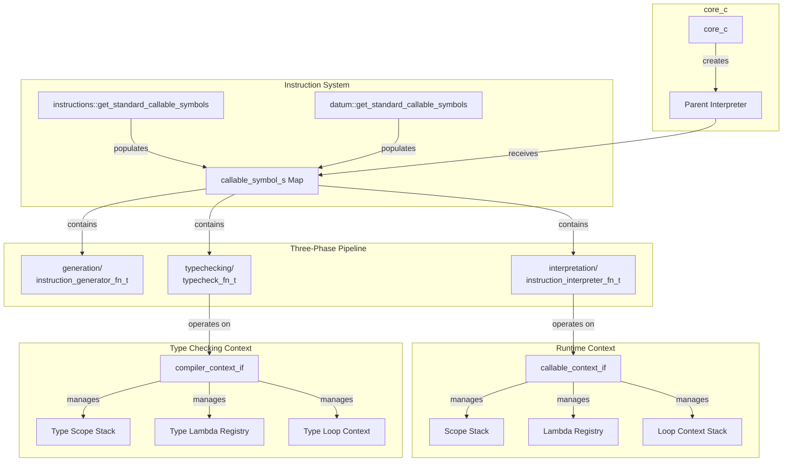

# SXS Instructions System

## Overview

The SXS instructions system provides the core language primitives that define program behavior. Instructions are C++-implemented callable symbols that handle control flow, variable binding, function definition, type reflection, error handling, loops, and data manipulation. The system operates through a three-phase architecture: generation (reserved for future compilation), interpretation (runtime execution), and type checking (compile-time validation).

**Note:** This document describes the instruction system architecture and implementation. For information on how the core orchestrator manages the overall runtime, see `core.md`. For details on imports and kernels subsystems, see `imports.md` and `kernels.md`.

### Key Design Principles

- **Unified Symbol Table**: Instructions registered as `callable_symbol_s` entries with metadata for all three phases
- **Type Safety**: Compile-time validation mirrors runtime behavior through parallel type checking
- **Scope Management**: Instructions manipulate interpreter scope stack for variable binding and isolation
- **Lambda System**: First-class functions via aberrant type with unique IDs and signature tracking
- **Error Propagation**: Structured error handling through `try`/`recover` with injected symbols
- **Loop Protocol**: Explicit loop context with iteration tracking and early exit via `done`
- **Datum Separation**: Structural initialization commands (`import`, `load`) execute before runtime lock

### Instruction Categories

**Variable & Function Definition:**
- `def` - Define symbol in current scope
- `fn` - Create lambda with typed parameters and body

**Control Flow:**
- `if` - Conditional branching
- `do`/`done` - Infinite loop with explicit exit

**Type Introspection:**
- `reflect` - Type-based dispatch with handler selection
- `match` - Value-based pattern matching
- `cast` - Type conversion and coercion

**Error Handling:**
- `try` - Catch error objects with handler
- `recover` - Catch C++ exceptions with handler
- `assert` - Runtime assertion with message

**Data Access:**
- `at` - Index into collections and strings
- `eq` - Deep equality comparison

**Meta-Programming:**
- `eval` - Parse and execute string as code
- `apply` - Apply lambda to argument list

**Module System (Datum):**
- `#(import ...)` - Load SXS module into isolated sub-interpreter
- `#(load ...)` - Load native kernel dylib
- `#(debug ...)` - Debug output during initialization

**Debugging:**
- `debug` - Runtime debug output

**Export:**
- `export` - Publish symbol for import by other modules

## Architecture



## Core Components

### callable_symbol_s

The unified metadata structure connecting all three phases of instruction processing.

**Structure:**
```cpp
struct callable_symbol_s {
  slp::slp_type_e return_type;
  instruction_generator_fn_t instruction_generator;
  std::vector<callable_parameter_s> required_parameters;
  std::map<std::string, slp::slp_type_e> injected_symbols;
  bool variadic;
  instruction_interpreter_fn_t function;
  typecheck_fn_t typecheck_function;
};
```

**Fields:**
- `return_type`: Expected return type for type checking
- `instruction_generator`: Optional bytecode generation function (reserved)
- `required_parameters`: Parameter specifications with names and types
- `injected_symbols`: Symbols automatically defined in scope (e.g., `$error`, `$iterations`)
- `variadic`: Whether instruction accepts variable arguments
- `function`: Runtime interpretation function
- `typecheck_function`: Compile-time validation function

### Instruction Registration

**Standard Instructions:**
```cpp
namespace pkg::core::instructions {
  std::map<std::string, callable_symbol_s> get_standard_callable_symbols();
}
```

Registers: `def`, `fn`, `debug`, `export`, `if`, `reflect`, `try`, `assert`, `recover`, `eval`, `apply`, `match`, `cast`, `do`, `done`, `at`, `eq`

**Datum Instructions:**
```cpp
namespace pkg::core::datum {
  std::map<std::string, callable_symbol_s> get_standard_callable_symbols();
}
```

Registers: `debug` (datum variant), `import`, `load`

### callable_context_if

Runtime interface providing instruction implementations access to interpreter state.

**Key Operations:**
- `eval(obj)`: Evaluate SLP object in current context
- `define_symbol(name, value)`: Bind symbol in current scope
- `has_symbol(name, current_only)`: Check symbol existence
- `push_scope()` / `pop_scope()`: Manage scope stack
- `allocate_lambda_id()`: Generate unique lambda identifier
- `register_lambda(id, params, return_type, body)`: Register lambda definition
- `get_lambda_signature(id)`: Retrieve lambda type signature
- `push_loop_context()` / `pop_loop_context()`: Manage loop state
- `signal_loop_done(value)`: Signal loop exit with return value
- `get_import_context()`: Access import subsystem
- `get_kernel_context()`: Access kernel subsystem
- `is_symbol_enscribing_valid_type(sym, type)`: Validate type symbols

### compiler_context_if

Type checking interface mirroring runtime context for compile-time validation.

**Key Operations:**
- `eval_type(obj)`: Compute type of SLP object
- `define_symbol(name, type)`: Bind symbol type in current scope
- `has_symbol(name, current_only)`: Check symbol type existence
- `push_scope()` / `pop_scope()`: Manage type scope stack
- `allocate_lambda_id()`: Generate unique lambda type identifier
- `register_lambda(id, signature)`: Register lambda type signature
- `get_lambda_signature(id)`: Retrieve lambda signature
- `types_match(t1, t2)`: Compare type compatibility
- `is_type_symbol(sym, type)`: Validate and resolve type symbols
- `get_current_exports()`: Access export type map for validation
- `resolve_file_path(path)`: Resolve import file paths
- `load_kernel_types(name, dir)`: Load kernel function type signatures

## Instruction Pipeline

### Phase 1: Generation (Reserved)

**Purpose:** Future bytecode or IR generation for ahead-of-time compilation.

**Current State:** All generation functions are no-op stubs returning empty byte vectors.

**Signature:**
```cpp
typedef std::function<byte_vector_t(callable_context_if &context,
                                    slp::slp_object_c &args_list)>
    instruction_generator_fn_t;

enum class hll_instruction_e {
  NOP, DEFINE, FN, DEBUG, EXPORT, IF, REFLECT, TRY, ASSERT,
  RECOVER, EVAL, APPLY, MATCH, CAST, DO, DONE, AT, EQ
};
```

**Design Intent:**
- Generate bytecode representation of instruction
- Enable compilation to standalone executable
- Support optimization passes on generated code
- Currently prints debug message and returns empty vector

### Phase 2: Interpretation (Runtime)

**Purpose:** Execute instructions in the live interpreter context.

**Signature:**
```cpp
typedef std::function<slp::slp_object_c(callable_context_if &context,
                                        slp::slp_object_c &args_list)>
    instruction_interpreter_fn_t;
```

**Execution Flow:**
1. Interpreter encounters paren list `(instruction arg1 arg2 ...)`
2. Looks up instruction name in callable symbols map
3. Validates argument count against `required_parameters`
4. Calls `function` pointer with context and args list
5. Instruction manipulates context (scopes, symbols, lambdas)
6. Returns SLP object result

**Error Handling:**
- Throw `std::runtime_error` for validation failures
- Return error objects `@(message)` for recoverable errors
- Exceptions propagate to `recover` or top-level catch

### Phase 3: Type Checking (Compile-Time)

**Purpose:** Validate instruction usage and infer types without execution.

**Signature:**
```cpp
typedef std::function<type_info_s(compiler_context_if &context,
                                  slp::slp_object_c &args_list)>
    typecheck_fn_t;
```

**Validation Flow:**
1. Type checker encounters paren list during validation pass
2. Looks up instruction name in callable symbols map
3. Calls `validate_parameters` helper to check argument types
4. Calls `typecheck_function` to compute result type
5. Returns `type_info_s` describing result type

**Parameter Validation:**
```cpp
static void validate_parameters(compiler_context_if &context,
                                slp::slp_object_c &args_list,
                                const std::string &cmd_name);
```

- Checks argument count against `required_parameters` and `variadic`
- Validates parameter types match expected types
- Allows `ABERRANT` type to match any type (polymorphic)
- Throws `std::runtime_error` on validation failure

**Type Checking vs Runtime:**
- Type checking runs before interpreter creation
- Validates imports and kernels without loading them
- Operates on `type_info_s` instead of `slp::slp_object_c` values
- Enables fast validation without execution overhead
- Supports ahead-of-time validation workflows

## Core Instruction Reference

### def - Variable Definition

**Syntax:** `(def symbol value)`

**Purpose:** Define a new symbol in the current scope with evaluated value.

**Parameters:**
- `symbol`: Symbol name (must be SYMBOL type)
- `value`: Expression to evaluate and bind (ABERRANT - any type)

**Return Type:** NONE

**Runtime Behavior:**
1. Validate symbol is not already defined in current scope
2. Evaluate value expression
3. Bind symbol to evaluated value in current scope
4. Return empty object

**Type Checking:**
1. Validate symbol not already defined in current scope
2. Compute type of value expression
3. Bind symbol name to computed type in type scope
4. Return NONE type

**Example:**
```scheme
(def x 42)
(def message "hello")
(def compute (fn () :int [100]))
```

**Errors:**
- Symbol already defined in current scope
- First argument not a symbol

### fn - Lambda Definition

**Syntax:** `(fn (param1 :type1 param2 :type2 ...) :return-type [body])`

**Purpose:** Create first-class function with typed parameters and body.

**Parameters:**
- `params`: Paren list of alternating parameter names and type symbols
- `return_type`: Symbol specifying return type
- `body`: Bracket list containing function body

**Return Type:** ABERRANT (lambda reference)

**Runtime Behavior:**
1. Validate parameter list structure (pairs of name/type)
2. Validate return type symbol
3. Allocate unique lambda ID
4. Register lambda with parameters, return type, and body
5. Create aberrant object containing lambda ID
6. Return aberrant object

**Type Checking:**
1. Validate parameter types and return type
2. Push new scope with parameter bindings
3. Type check body in parameter scope
4. Validate body type matches declared return type
5. Allocate lambda type ID and register signature
6. Build signature string `:fn<param_types>return_type`
7. Return ABERRANT type with lambda signature

**Lambda Signature Format:**
```
:fn<type1,type2,...>return_type
```
Types encoded as integer enum values.

**Example:**
```scheme
(def add (fn (a :int b :int) :int [
  (alu/add a b)
]))

(def greet (fn (name :str) :str [
  (cast :str {name " welcome"})
]))
```

**Errors:**
- Parameter list not paren list
- Parameters not in name/type pairs
- Invalid type symbols
- Body not bracket list
- Body type mismatch with declared return type

### debug - Debug Output

**Syntax:** `(debug expr1 expr2 ...)`

**Purpose:** Print evaluated expressions to stdout for debugging.

**Parameters:** Variadic - accepts any number of expressions

**Return Type:** NONE

**Runtime Behavior:**
1. Print `[DEBUG]` prefix
2. For each argument:
   - Evaluate expression
   - Print space separator
   - Print value based on type (int, real, symbol, string)
   - Print type code for other types
3. Print newline
4. Return empty object

**Type Checking:**
1. Type check each argument expression
2. Return INTEGER type (datum variant returns INTEGER, standard returns NONE)

**Example:**
```scheme
(debug x y z)
(debug "checkpoint" iteration)
```

**Note:** Datum variant `#(debug ...)` executes during initialization phase.

### export - Module Export

**Syntax:** `(export symbol value)`

**Purpose:** Define symbol and register it for import by other modules.

**Parameters:**
- `symbol`: Export name (SYMBOL type)
- `value`: Expression to evaluate and export (ABERRANT - any type)

**Return Type:** NONE

**Runtime Behavior:**
1. Evaluate value expression
2. Define symbol in current scope
3. Register export with import context
4. Return empty object

**Type Checking:**
1. Compute type of value expression
2. Define symbol type in current scope
3. Add to current exports map for import validation
4. Return NONE type

**Example:**
```scheme
(export add (fn (a :int b :int) :int [
  (alu/add a b)
]))

(export PI 3.14159)
```

**Errors:**
- No import context available
- Export registration failed
- First argument not a symbol

**Usage:** Only meaningful in files loaded via `#(import ...)`.

### if - Conditional Branch

**Syntax:** `(if condition true-branch false-branch)`

**Purpose:** Execute one of two branches based on condition value.

**Parameters:**
- `condition`: Expression evaluating to integer (ABERRANT - any type)
- `true-branch`: Expression to execute if condition non-zero (ABERRANT)
- `false-branch`: Expression to execute if condition zero (ABERRANT)

**Return Type:** ABERRANT (type of executed branch)

**Runtime Behavior:**
1. Evaluate condition expression
2. If result is INTEGER type and non-zero, execute true branch
3. Otherwise execute false branch
4. Return result of executed branch

**Type Checking:**
1. Validate condition type is INTEGER
2. Compute types of both branches
3. Validate both branches return same type
4. Return branch type

**Example:**
```scheme
(if (alu/eq x 0)
  "zero"
  "non-zero")

(if condition
  [
    (debug "true path")
    42
  ]
  [
    (debug "false path")
    0
  ])
```

**Errors:**
- Condition not integer type (type checking)
- Branch types mismatch (type checking)

### reflect - Type-Based Dispatch

**Syntax:** `(reflect value (:type1 body1) (:type2 body2) ...)`

**Purpose:** Execute handler based on runtime type of value.

**Parameters:**
- `value`: Expression to evaluate and inspect (ABERRANT - any type)
- `handlers`: Variadic paren lists of `(:type body)` pairs

**Return Type:** ABERRANT (type of matched handler body)

**Runtime Behavior:**
1. Evaluate value expression
2. Get runtime type of result
3. For each handler:
   - Extract type symbol and body
   - For ABERRANT values, match lambda signature
   - For other types, resolve type symbol and compare
   - If match, evaluate and return body
4. If no match, return error object `@(handler not supplied for given type)`

**Type Checking:**
1. Compute type of value expression
2. For each handler:
   - Validate handler structure
   - Validate type symbol
   - Type check body expression
3. Return NONE type (cannot statically determine which handler executes)

**Example:**
```scheme
(reflect x
  (:int (debug "integer" x))
  (:str (debug "string" x))
  (:real (debug "real" x)))

(reflect my_fn
  (:fn<10,10>10 (debug "int->int function"))
  (:fn<6,6>6 (debug "str->str function")))
```

**Errors:**
- Handler not paren list
- Handler not exactly 2 elements
- Type symbol invalid
- Value type not handled (returns error object)

### try - Error Object Handler

**Syntax:** `(try body handler)`

**Purpose:** Catch error objects returned by body and execute handler.

**Parameters:**
- `body`: Expression to evaluate (ABERRANT - any type)
- `handler`: Expression or bracket list to execute on error (ABERRANT)

**Return Type:** ABERRANT (type of body or handler)

**Injected Symbols:**
- `$error`: The inner object wrapped by error type (if handler is bracket list)

**Runtime Behavior:**
1. Evaluate body expression
2. If result is ERROR type:
   - Extract inner object from error wrapper
   - If handler is bracket list:
     - Push new scope
     - Define `$error` symbol with inner object
     - Evaluate handler bracket list
     - Pop scope
   - Else evaluate handler expression
   - Return handler result
3. Else return body result

**Type Checking:**
1. Compute type of body
2. If handler is bracket list:
   - Push scope with `$error` injected symbol
   - Type check handler in new scope
   - Pop scope
3. Else type check handler expression
4. Validate body and handler types match
5. Return body type

**Example:**
```scheme
(try
  (kv/get store key)
  [
    (debug "Error:" $error)
    ()
  ])

(try (risky-operation) default-value)
```

**Errors:**
- Body and handler type mismatch (type checking)

**Note:** Catches error objects `@(...)`, not C++ exceptions. Use `recover` for exceptions.

### assert - Runtime Assertion

**Syntax:** `(assert condition message)`

**Purpose:** Throw exception if condition is false.

**Parameters:**
- `condition`: Integer expression (must be INTEGER type)
- `message`: String message for failure (must be DQ_LIST type)

**Return Type:** NONE

**Runtime Behavior:**
1. Evaluate condition expression
2. Evaluate message expression
3. Validate types (INTEGER and DQ_LIST)
4. If condition is zero, throw `std::runtime_error` with message
5. Return empty object

**Type Checking:**
1. Validate condition type is INTEGER
2. Validate message type is DQ_LIST
3. Return NONE type

**Example:**
```scheme
(assert (alu/gt x 0) "x must be positive")
(assert (eq (at 0 list) expected) "first element mismatch")
```

**Errors:**
- Condition not integer type
- Message not string type
- Assertion failure (throws exception)

### recover - Exception Handler

**Syntax:** `(recover [body] [handler])`

**Purpose:** Catch C++ exceptions thrown by body and execute handler.

**Parameters:**
- `body`: Bracket list to execute (must be BRACKET_LIST)
- `handler`: Bracket list to execute on exception (must be BRACKET_LIST)

**Return Type:** ABERRANT (type of body or handler)

**Injected Symbols:**
- `$exception`: String containing exception message (DQ_LIST type)

**Runtime Behavior:**
1. Execute body bracket list in try block
2. If exception caught:
   - Convert exception message to string object
   - Push new scope
   - Define `$exception` symbol with message string
   - Evaluate handler bracket list
   - Pop scope
   - Return handler result
3. Else return body result

**Type Checking:**
1. Compute type of body
2. Push scope with `$exception` injected symbol (DQ_LIST type)
3. Type check handler in new scope
4. Pop scope
5. Validate body and handler types match
6. Return body type

**Example:**
```scheme
(recover
  [
    (assert (eq x 0) "x must be zero")
    "success"
  ]
  [
    (debug "Exception caught:" $exception)
    "failed"
  ])
```

**Errors:**
- Body not bracket list
- Handler not bracket list
- Body and handler type mismatch (type checking)

**Note:** Catches C++ exceptions, not error objects. Use `try` for error objects.

### eval - Dynamic Code Execution

**Syntax:** `(eval code-string)`

**Purpose:** Parse and execute string as SXS code in new scope.

**Parameters:**
- `code`: String containing SXS code (must be DQ_LIST type)

**Return Type:** ABERRANT (cannot statically determine)

**Runtime Behavior:**
1. Evaluate code expression
2. Validate result is string type
3. Parse string using `slp::parse`
4. Push new scope
5. Evaluate parsed object
6. Pop scope
7. Return evaluation result

**Type Checking:**
1. Validate code expression type is DQ_LIST
2. Return NONE type (cannot statically determine eval result type)

**Example:**
```scheme
(eval "(def x 42)")
(eval "(alu/add 10 20)")

(def code-gen (fn () :str ["(debug \"generated\")"]))
(eval (code-gen))
```

**Errors:**
- Code not string type
- Parse error in code string
- Runtime error during evaluation

**Security Note:** Eval executes arbitrary code. Validate input carefully.

### apply - Lambda Application

**Syntax:** `(apply lambda args-list)`

**Purpose:** Call lambda with arguments from brace list.

**Parameters:**
- `lambda`: Lambda expression (must evaluate to ABERRANT)
- `args-list`: Brace list of arguments (must be BRACE_LIST)

**Return Type:** ABERRANT (lambda return type)

**Runtime Behavior:**
1. Evaluate lambda expression
2. Validate result is ABERRANT type
3. Evaluate args expression
4. Validate result is BRACE_LIST
5. Push new scope
6. Define temporary symbol for lambda
7. Define temporary symbols for each argument
8. Construct call string `(lambda-sym arg1-sym arg2-sym ...)`
9. Parse and evaluate call
10. Pop scope
11. Return call result

**Type Checking:**
1. Validate lambda type is ABERRANT
2. Validate args type is BRACE_LIST
3. Return NONE type (cannot statically validate argument types)

**Example:**
```scheme
(def add (fn (a :int b :int) :int [(alu/add a b)]))
(apply add {10 20})

(def args {5 3})
(apply math/multiply args)
```

**Errors:**
- Lambda not aberrant type
- Args not brace list
- Argument count/type mismatch during call

### match - Value Pattern Matching

**Syntax:** `(match value (pattern1 result1) (pattern2 result2) ...)`

**Purpose:** Execute handler for first matching pattern value.

**Parameters:**
- `value`: Expression to evaluate and match (ABERRANT - any type)
- `handlers`: Variadic paren lists of `(pattern result)` pairs

**Return Type:** ABERRANT (type of matched result)

**Runtime Behavior:**
1. Evaluate value expression
2. Get runtime type of result
3. For each handler:
   - Extract pattern and result expressions
   - Evaluate pattern expression
   - If pattern type != value type, skip
   - Compare values based on type:
     - INTEGER: numeric equality
     - REAL: numeric equality
     - SYMBOL: string equality
     - DQ_LIST: string equality
     - ABERRANT: lambda ID equality
     - Lists: recursive element-wise equality
   - If match, evaluate and return result
4. If no match, return error object `@(no matching handler found)`

**Type Checking:**
1. Compute type of value expression
2. Validate value type is not ABERRANT (cannot match lambdas statically)
3. For each handler:
   - Validate handler structure
   - Type check pattern expression
   - Warn if pattern type != value type
   - Type check result expression
4. Return NONE type (cannot statically determine which handler executes)

**Example:**
```scheme
(match x
  (0 "zero")
  (1 "one")
  (2 "two"))

(match (get-status)
  (ok "success")
  (error "failed")
  (pending "waiting"))
```

**Errors:**
- Handler not paren list
- Handler not exactly 2 elements
- No matching handler (returns error object)
- Cannot match on aberrant types (type checking)

### cast - Type Conversion

**Syntax:** `(cast :target-type value)`

**Purpose:** Convert value to target type with defined conversion rules.

**Parameters:**
- `type`: Type symbol specifying target type (SYMBOL)
- `value`: Expression to convert (ABERRANT - any type)

**Return Type:** ABERRANT (target type)

**Runtime Behavior:**
1. Validate type symbol
2. Evaluate value expression
3. If value type == target type, return value unchanged
4. Apply conversion rules:

**Conversion Rules:**

**INTEGER ↔ REAL:**
- `int → real`: Cast to double
- `real → int`: Truncate to int64

**List Type Conversions:**
- `DQ_LIST → PAREN/BRACE/BRACKET`: Convert string bytes to integer list
- `PAREN/BRACE/BRACKET → DQ_LIST`: Convert integer list to byte string
- `PAREN/BRACE/BRACKET → PAREN/BRACE/BRACKET`: Reconstruct list with new delimiters
- `SOME → list`: Unwrap SOME and convert inner value

**To String (DQ_LIST):**
- `INTEGER`: `std::to_string`
- `REAL`: `std::to_string`
- `SYMBOL`: Symbol name
- `NONE`: `"()"`
- `ABERRANT`: `"?lambda"`
- `ERROR`: Recursively cast inner object, wrap with `@(...)`
- `SOME`: Recursively cast inner object, prefix with `'`
- `DATUM`: Recursively cast inner object, prefix with `#`
- Lists: Convert elements to strings and join

**Type Checking:**
1. Validate type symbol
2. Compute type of value expression
3. Return target type

**Example:**
```scheme
(cast :int 3.14)
(cast :real 42)
(cast :str 123)
(cast :str {72 101 108 108 111})
(cast :list-b "Hello")
(cast :list-b (1 2 3))
```

**Errors:**
- Invalid type symbol
- Unsupported conversion (throws exception)
- Complex list structures cannot convert

### do - Infinite Loop

**Syntax:** `(do [body])`

**Purpose:** Execute body repeatedly until `done` called.

**Parameters:**
- `body`: Bracket list to execute each iteration (must be BRACKET_LIST)

**Return Type:** ABERRANT (type of value passed to `done`)

**Injected Symbols:**
- `$iterations`: Integer count of current iteration (0-indexed)

**Runtime Behavior:**
1. Push loop context
2. Loop:
   - Push new scope
   - Define `$iterations` with current iteration count
   - Evaluate body
   - Pop scope
   - If `done` was called, break
   - Increment iteration counter
3. Get return value from loop context
4. Pop loop context
5. Return loop return value

**Type Checking:**
1. Push loop context
2. Push scope with `$iterations` injected symbol (INTEGER type)
3. Type check body
4. Pop scope
5. Pop loop context
6. Return ABERRANT type (cannot statically determine `done` value type)

**Example:**
```scheme
(do [
  (debug "iteration" $iterations)
  (if (alu/gt $iterations 10)
    (done $iterations)
    ())
])

(def sum 0)
(do [
  (def sum (alu/add sum $iterations))
  (if (alu/eq $iterations 100)
    (done sum)
    ())
])
```

**Errors:**
- Body not bracket list

**Note:** Must call `done` to exit loop. Infinite loop otherwise.

### done - Loop Exit

**Syntax:** `(done return-value)`

**Purpose:** Exit enclosing `do` loop with return value.

**Parameters:**
- `value`: Expression to return from loop (ABERRANT - any type)

**Return Type:** NONE

**Runtime Behavior:**
1. Validate inside loop context
2. Evaluate value expression
3. Signal loop exit with value
4. Return empty object (control never reaches here)

**Type Checking:**
1. Validate inside loop context
2. Type check value expression
3. Return NONE type

**Example:**
```scheme
(do [
  (if (condition)
    (done result)
    ())
])
```

**Errors:**
- Called outside `do` loop

### at - Collection Indexing

**Syntax:** `(at index collection)`

**Purpose:** Access element at index in collection or string.

**Parameters:**
- `index`: Integer index (must be INTEGER)
- `collection`: List or string to index (ABERRANT - list or string type)

**Return Type:** ABERRANT (element type or INTEGER for strings)

**Runtime Behavior:**
1. Evaluate index expression
2. Validate index is INTEGER type
3. Validate index >= 0
4. Evaluate collection expression
5. Based on collection type:
   - **DQ_LIST**: Return byte at index as INTEGER
   - **PAREN_LIST/BRACKET_LIST/BRACE_LIST**: Return element at index
6. If index out of bounds, return error object `@(index out of bounds)`

**Type Checking:**
1. Validate index type is INTEGER
2. Validate collection type is list or string
3. Return NONE type (cannot statically determine element type)

**Example:**
```scheme
(at 0 [1 2 3])
(at 2 "hello")
(at idx my-list)
```

**Errors:**
- Index not integer type
- Negative index (returns error object)
- Index out of bounds (returns error object)
- Collection not list or string type

### eq - Deep Equality

**Syntax:** `(eq lhs rhs)`

**Purpose:** Compare two values for deep structural equality.

**Return Type:** INTEGER (1 for equal, 0 for not equal)

**Parameters:**
- `lhs`: Left-hand value (ABERRANT - any type)
- `rhs`: Right-hand value (ABERRANT - any type)

**Runtime Behavior:**
1. Evaluate both expressions
2. If types differ, return 0
3. Based on type:
   - **ABERRANT**: Compare lambda IDs
   - **ERROR/SOME/DATUM**: Recursively compare inner objects
   - **Lists**: Recursively compare elements
   - **Other types**: Cast to string and compare

**Comparison Rules:**

**Primitive Types:**
- Cast both to string and compare strings

**Lambda (ABERRANT):**
- Compare lambda IDs for equality

**Wrapper Types (ERROR/SOME/DATUM):**
- Extract inner objects
- Recursively call `eq` on inner objects

**Lists (PAREN/BRACKET/BRACE):**
- Compare sizes
- Recursively call `eq` on each element pair
- Return 0 if any element differs

**Type Checking:**
1. Type check both expressions
2. Return INTEGER type

**Example:**
```scheme
(eq 42 42)
(eq "hello" "hello")
(eq [1 2 3] [1 2 3])
(eq my-lambda my-lambda)
```

**Errors:** None (always returns 0 or 1)

## Datum Instructions

Datum instructions execute during the initialization phase before the runtime lock is triggered. They are prefixed with `#` and handle structural loading of imports and kernels.

### #(import ...) - Module Import

**Syntax:** `#(import symbol1 "path1" symbol2 "path2" ...)`

**Purpose:** Load SXS modules into isolated sub-interpreters.

**Parameters:** Variadic pairs of symbol and file path string

**Return Type:** NONE

**Runtime Behavior:**
1. Validate imports are allowed (not locked)
2. For each symbol/path pair:
   - Validate types (SYMBOL and DQ_LIST)
   - Call `import_context->attempt_import(symbol, path)`
   - Throws exception on failure

**Type Checking:**
1. Validate argument pairs
2. For each import:
   - Resolve file path
   - Check for circular imports
   - Parse and type check import file
   - Register exported symbols with prefix
3. Return NONE type

**Example:**
```scheme
#(import math "math.sxs")
#(import utils "lib/utils.sxs" helpers "lib/helpers.sxs")
```

**Errors:**
- Imports locked (called after runtime started)
- Invalid argument types
- File not found
- Circular import detected
- Type checking failure in imported file

**See:** `imports.md` for detailed import system documentation.

### #(load ...) - Kernel Loading

**Syntax:** `#(load "kernel1" "kernel2" ...)`

**Purpose:** Load native C++ kernel dylibs.

**Parameters:** Variadic kernel name strings

**Return Type:** NONE

**Runtime Behavior:**
1. Validate kernel loading is allowed (not locked)
2. For each kernel name:
   - Validate type (DQ_LIST)
   - Call `kernel_context->attempt_load(name)`
   - Throws exception on failure

**Type Checking:**
1. Validate argument types
2. For each kernel:
   - Resolve kernel path
   - Load kernel type signatures from `kernel.sxs`
   - Register function types
3. Return NONE type

**Example:**
```scheme
#(load "alu")
#(load "io" "kv" "random")
```

**Errors:**
- Kernels locked (called after runtime started)
- Invalid argument types
- Kernel not found
- Dylib load failure
- Function registration failure

**See:** `kernels.md` for detailed kernel system documentation.

### #(debug ...) - Initialization Debug

**Syntax:** `#(debug expr1 expr2 ...)`

**Purpose:** Print debug output during initialization phase.

**Parameters:** Variadic expressions

**Return Type:** INTEGER (datum variant returns INTEGER, not NONE)

**Runtime Behavior:** Same as standard `debug` instruction

**Type Checking:** Same as standard `debug` instruction

**Example:**
```scheme
#(debug "Loading modules...")
#(import math "math.sxs")
#(debug "Modules loaded")
```

## Type Checking Architecture

### Separation from Runtime

The type checking system operates independently from runtime execution, enabling fast validation without interpreter overhead.

**Key Differences:**

| Aspect | Runtime | Type Checking |
|--------|---------|---------------|
| Context | `callable_context_if` | `compiler_context_if` |
| Values | `slp::slp_object_c` | `type_info_s` |
| Symbols | Bound to values | Bound to types |
| Lambdas | Body + closure | Signature only |
| Imports | Sub-interpreters | Type exports |
| Kernels | Dylib functions | Function signatures |
| Execution | Full evaluation | Type inference |

### type_info_s

Type descriptor used during type checking.

**Structure:**
```cpp
struct type_info_s {
  slp::slp_type_e base_type;
  std::string lambda_signature;
  std::uint64_t lambda_id;
};
```

**Fields:**
- `base_type`: Primary type (INTEGER, DQ_LIST, ABERRANT, etc.)
- `lambda_signature`: For ABERRANT types, signature string
- `lambda_id`: For ABERRANT types, unique identifier

### Parameter Validation

Shared validation logic used by all type checking functions.

**validate_parameters:**
1. Look up instruction in callable symbols map
2. Check argument count against `required_parameters` and `variadic`
3. For each required parameter:
   - If type is ABERRANT, skip validation (polymorphic)
   - If type is SYMBOL, validate argument is SYMBOL
   - Otherwise, compute argument type and validate match
4. Throw exception on validation failure

**Example:**
```cpp
validate_parameters(context, args_list, "if");
```

### Import Type Checking

Type checking imports without creating sub-interpreters:

1. Resolve import file path
2. Check for circular imports using `currently_checking` set
3. Parse import file
4. Create separate compiler context for import
5. Type check import file in isolation
6. Extract exported symbol types
7. Register exports with prefix in parent context
8. Remap lambda IDs to avoid conflicts

**Benefits:**
- Fast validation without execution
- Detects circular imports early
- Validates export availability
- No sub-interpreter overhead

### Kernel Type Checking

Type checking kernels without loading dylibs:

1. Resolve kernel directory path
2. Parse `kernel.sxs` metadata file
3. Extract function signatures
4. Register function types in compiler context
5. Validate function calls against signatures

**Benefits:**
- Validates kernel availability without dylib load
- Type checks kernel function calls
- No native code execution during validation
- Supports ahead-of-time validation

## Scope and Context Management

### Scope Stack

Instructions manipulate a stack of symbol scopes for variable binding and isolation.

**Operations:**
- `push_scope()`: Create new scope level
- `pop_scope()`: Remove current scope level
- `define_symbol(name, value/type)`: Bind in current scope
- `has_symbol(name, current_only)`: Check existence

**Scope Lifetime:**

**Bracket Lists:**
- Automatic scope push before evaluation
- Automatic scope pop after evaluation
- Symbols defined inside bracket list not visible outside

**Explicit Scope Management:**
- `try` with bracket list handler
- `recover` handler
- `eval` execution
- `do` loop iterations
- `fn` body during type checking

**Example:**
```scheme
[
  (def x 10)
  (debug x)
]
(debug x)
```
Second `debug` fails - `x` not defined outside bracket list.

### Lambda System

First-class functions implemented via aberrant type with unique IDs.

**Lambda Lifecycle:**

**1. Definition (`fn`):**
- Allocate unique lambda ID
- Register lambda with parameters, return type, and body
- Create aberrant object containing ID
- Return aberrant object

**2. Storage:**
- Lambda stored in interpreter's lambda registry
- ID maps to parameter list, return type, and body object
- Signature string computed for type checking

**3. Invocation:**
- Interpreter detects aberrant value in call position
- Extracts lambda ID from aberrant object
- Looks up lambda definition in registry
- Pushes new scope
- Binds parameters to arguments
- Evaluates body in parameter scope
- Pops scope
- Returns body result

**4. Type Checking:**
- Lambda signature stored separately in type checker
- Signature format: `:fn<param_types>return_type`
- Used by `reflect` for type-based dispatch
- Validated during function calls

**Lambda Signature Encoding:**
```
:fn<10,10>10    // (int, int) -> int
:fn<6,6>6       // (str, str) -> str
:fn<>10         // () -> int
```

Types encoded as `slp::slp_type_e` enum integer values.

### Loop Context

Loop state management for `do`/`done` protocol.

**Loop Context Structure:**
- Iteration counter (0-indexed)
- Exit flag
- Return value
- Stack of loop contexts (for nested loops)

**Operations:**
- `push_loop_context()`: Enter loop
- `pop_loop_context()`: Exit loop
- `is_in_loop()`: Check if inside loop
- `get_current_iteration()`: Get iteration count
- `increment_iteration()`: Advance counter
- `signal_loop_done(value)`: Set exit flag and return value
- `should_exit_loop()`: Check exit flag
- `get_loop_return_value()`: Get return value

**Nested Loops:**
```scheme
(do [
  (do [
    (if (inner-condition)
      (done inner-result)
      ())
  ])
  (if (outer-condition)
    (done outer-result)
    ())
])
```

Each `done` exits only its immediate enclosing `do`.

### Injected Symbols

Some instructions automatically define symbols in their scope.

**Injected Symbol Mechanism:**
1. Instruction metadata includes `injected_symbols` map
2. Before evaluating body/handler, push scope
3. Define each injected symbol in new scope
4. Evaluate body/handler
5. Pop scope (injected symbols removed)

**Injected Symbols by Instruction:**

| Instruction | Symbol | Type | Description |
|-------------|--------|------|-------------|
| `try` | `$error` | ABERRANT | Inner object from error wrapper |
| `recover` | `$exception` | DQ_LIST | Exception message string |
| `do` | `$iterations` | INTEGER | Current iteration count (0-indexed) |

**Example:**
```scheme
(try
  (risky-operation)
  [
    (debug "Error occurred:" $error)
    (cast :str $error)
  ])

(do [
  (debug "Iteration" $iterations)
  (if (alu/eq $iterations 10)
    (done "finished")
    ())
])
```

## Locking Protocol

### Import and Kernel Locking

Imports and kernels can only be loaded during initialization phase.

**Lock Trigger:**
- First non-datum expression in a bracket list
- Interpreter sets `imports_locks_triggered_` flag
- Calls `import_context->lock()` and `kernel_context->lock()`
- Both subsystems set their locked flags

**Post-Lock Behavior:**
- `#(import ...)` checks `is_import_allowed()`, throws if locked
- `#(load ...)` checks `is_load_allowed()`, throws if locked
- Ensures all structural loading complete before computation

**Example:**
```scheme
#(import math "math.sxs")
#(load "alu")

(def x 10)
```

After `(def x 10)` executes, imports and kernels are locked.

**Rationale:**
- All dependencies known before execution
- Enables static analysis of module graph
- Prevents dynamic loading during runtime
- Aligns with type checking expectations

**See:** `core.md` for detailed locking protocol documentation.

## Usage Patterns and Best Practices

### Error Handling

**Use `try` for Error Objects:**
```scheme
(try
  (kv/get store key)
  [
    (debug "Key not found:" $error)
    default-value
  ])
```

**Use `recover` for Exceptions:**
```scheme
(recover
  [
    (assert (alu/gt x 0) "x must be positive")
    (compute x)
  ]
  [
    (debug "Assertion failed:" $exception)
    fallback-value
  ])
```

**Use `assert` for Preconditions:**
```scheme
(def divide (fn (a :int b :int) :int [
  (assert (alu/gt b 0) "divisor must be non-zero")
  (alu/div a b)
]))
```

### Type Introspection

**Use `reflect` for Type-Based Dispatch:**
```scheme
(def process (fn (value :any) :str [
  (reflect value
    (:int (cast :str (alu/mul value 2)))
    (:str (cast :str {value " processed"}))
    (:real (cast :str (alu/mul_r value 2.0))))
]))
```

**Use `match` for Value-Based Dispatch:**
```scheme
(def status-message (fn (code :int) :str [
  (match code
    (0 "success")
    (1 "warning")
    (2 "error")
    (3 "fatal"))
]))
```

### Type Conversions

**String to Bytes:**
```scheme
(cast :list-b "Hello")
```

**Bytes to String:**
```scheme
(cast :str {72 101 108 108 111})
```

**Number to String:**
```scheme
(cast :str 42)
(cast :str 3.14)
```

**List Type Conversion:**
```scheme
(cast :list-b [1 2 3])
(cast :list-p (1 2 3))
```

### Loop Patterns

**Counted Loop:**
```scheme
(do [
  (process $iterations)
  (if (alu/eq $iterations 100)
    (done ())
    ())
])
```

**Conditional Loop:**
```scheme
(do [
  (def result (compute))
  (if (is-done result)
    (done result)
    ())
])
```

**Accumulator Loop:**
```scheme
(def sum 0)
(do [
  (def sum (alu/add sum $iterations))
  (if (alu/gt sum 1000)
    (done sum)
    ())
])
```

### Lambda Usage

**Higher-Order Functions:**
```scheme
(def map (fn (f :fn<10>10 list :list-b) :list-b [
  (def result [])
  (do [
    (if (alu/eq $iterations (at-size list))
      (done result)
      [
        (def elem (at $iterations list))
        (def mapped (apply f {elem}))
        (def result (append result mapped))
        ()
      ])
  ])
]))
```

**Closures (Limited):**
```scheme
(def make-adder (fn (x :int) :fn<10>10 [
  (fn (y :int) :int [
    (alu/add x y)
  ])
]))
```

**Note:** Closures capture by value at definition time, not by reference.

## System Limitations

### Instruction Set

1. **No Dynamic Instruction Registration**: Cannot define new instructions from SXS code
2. **No Macro System**: No compile-time code generation beyond `eval`
3. **Fixed Parameter Validation**: Cannot customize parameter checking per call
4. **No Operator Overloading**: Instructions have fixed behavior

### Type System

1. **Limited Type Inference**: `eval` and `apply` return NONE/ABERRANT types
2. **No Generic Types**: Cannot parameterize types
3. **No Union Types**: Cannot express "integer or string"
4. **No Structural Typing**: Only nominal type checking

### Pattern Matching

1. **No Nested Patterns**: `match` only compares top-level values
2. **No Destructuring**: Cannot extract components during match
3. **No Guards**: Cannot add conditions to patterns
4. **No Wildcard**: Must handle all cases or accept error object

### Error Handling

1. **No Exception Types**: All exceptions are strings
2. **No Stack Traces**: Error messages only
3. **No Error Propagation**: Must explicitly handle at each level
4. **No Finally Blocks**: No guaranteed cleanup

### Loops

1. **No Break/Continue**: Only `done` for exit
2. **No Loop Labels**: Cannot exit outer loop from inner
3. **No Iteration Protocol**: Cannot iterate over collections directly
4. **Manual Index Management**: Must track iteration manually

### Eval Boundaries

1. **Separate Scope**: `eval` executes in new scope
2. **String Parsing**: Must construct valid SXS syntax
3. **No Compile-Time Validation**: Errors only at runtime
4. **Performance Overhead**: Parse and eval on each call

## Design Rationale

### Why Three-Phase Architecture?

**Generation Phase (Reserved):**
- Future ahead-of-time compilation support
- Bytecode generation for optimization
- Separate compilation units
- Currently no-op, but interface defined

**Interpretation Phase:**
- Direct execution for rapid development
- Full access to runtime context
- Dynamic behavior and introspection
- Immediate feedback

**Type Checking Phase:**
- Fast validation without execution
- Catches errors before runtime
- Enables IDE tooling and static analysis
- Separate from runtime for security

### Why Aberrant Type for Lambdas?

**Benefits:**
- Unique type distinguishable from data
- Prevents accidental lambda serialization
- Enables type-based dispatch via `reflect`
- Clear separation from other types

**Implementation:**
- Lambda ID stored in aberrant object data
- Registry maps ID to definition
- Signature string for type checking
- Move semantics for efficient passing

### Why Injected Symbols?

**Benefits:**
- Explicit scope for special values
- No naming conflicts with user code
- Automatic cleanup via scope pop
- Metadata-driven injection

**Alternatives Rejected:**
- Global variables: Naming conflicts, no cleanup
- Magic symbols: Unclear semantics
- Return tuples: Awkward syntax

### Why Separate `try` and `recover`?

**Different Error Models:**
- `try`: Catches error objects `@(...)` returned by functions
- `recover`: Catches C++ exceptions thrown by assertions

**Benefits:**
- Clear distinction between error types
- Appropriate handling for each model
- Error objects are values (can be inspected)
- Exceptions are control flow (cannot be inspected)

**Use Cases:**
- `try`: Kernel functions returning errors
- `recover`: Assertions and validation failures

### Why `do`/`done` Instead of `while`?

**Benefits:**
- Explicit loop exit with return value
- Iteration tracking via `$iterations`
- No condition re-evaluation overhead
- Clear loop boundaries

**Flexibility:**
- Can exit anywhere in body
- Can return any value type
- Supports multiple exit conditions
- Nested loops with independent exit

**Alternatives Rejected:**
- `while`: Requires condition re-evaluation
- `for`: Limited to counted iteration
- `loop`: No explicit exit mechanism
