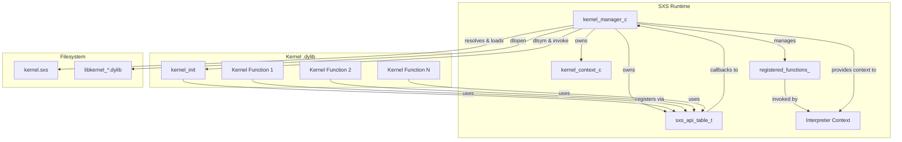
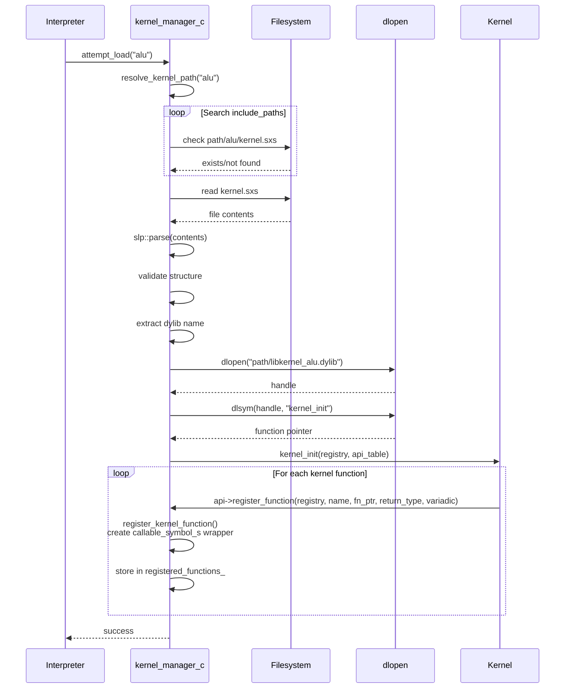
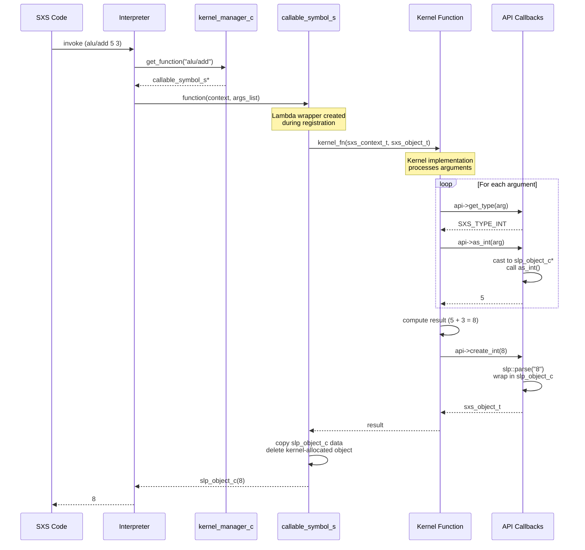
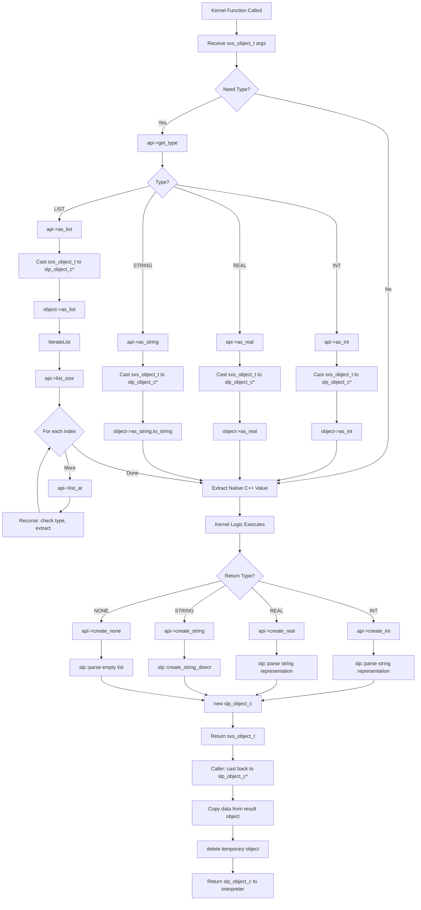

# SXS Kernel System

## Overview

The SXS kernel system provides a C-based plugin architecture for extending the language runtime with native compiled functions. Kernels are dynamically loaded shared libraries that register functions callable from SXS code, enabling high-performance operations while maintaining language safety through a well-defined API boundary.

### Key Design Goals

- **Language Interoperability**: Clean C API allows kernels in any language that can produce C-compatible shared libraries
- **Type Safety**: Explicit type annotations and runtime validation
- **Dynamic Loading**: Kernels loaded on-demand, locked after initialization phase
- **Zero-Copy Optimization**: Direct memory access to SLP objects where possible
- **Isolation**: Kernels execute in separate compilation units with controlled access to runtime

## Architecture



## Core Components

### kernel_manager_c

Central orchestrator managing the entire kernel subsystem lifecycle.

**Responsibilities:**
- Path resolution across include directories
- Dynamic library loading and symbol resolution
- Function registration and lookup
- Lifecycle management (load → register → lock → execute)
- API table provisioning to kernels

**Key State:**
- `include_paths_`: Search paths for kernel discovery
- `loaded_kernels_`: Set of successfully loaded kernel names
- `loaded_dylibs_`: Handles for dlopen'd libraries
- `registered_functions_`: Map of `kernel_name/function_name` → callable_symbol_s
- `kernels_locked_`: Flag preventing further loads after initialization

### kernel_context_if

Interface exposing kernel operations to the interpreter.

**Operations:**
- `is_load_allowed()`: Check if kernels can still be loaded
- `attempt_load(name)`: Trigger kernel loading
- `lock()`: Prevent further kernel loads
- `has_function(name)`: Check function availability
- `get_function(name)`: Retrieve callable symbol

### sxs_api_table_t

Function pointer table providing the C API to kernel implementations.

**Categories:**

1. **Registration**: `register_function` - called during kernel_init
2. **Evaluation**: `eval` - evaluate SXS objects in context
3. **Type Inspection**: `get_type` - query object type
4. **Type Extraction**: `as_int`, `as_real`, `as_string`, `as_list` - access typed data
5. **List Operations**: `list_size`, `list_at` - traverse list objects
6. **Object Creation**: `create_int`, `create_real`, `create_string`, `create_none` - construct return values

All API functions are implemented as callbacks into the C++ runtime with appropriate marshaling.

## Kernel Lifecycle



### Path Resolution Algorithm

1. Check if `kernel_name` is absolute path → use directly
2. Search each path in `include_paths_` for `path/kernel_name/kernel.sxs`
3. Search `working_directory_/kernel_name/kernel.sxs`
4. Return empty string if not found

### kernel.sxs Structure

```scheme
#(define-kernel <kernel-name> <dylib-filename> [
    (define-function <fn-name> (<arg> :<type> ...) :<return-type>)
    ...
])
```

**Example:**

```scheme
#(define-kernel alu "libkernel_alu.dylib" [
    (define-function add (a :int b :int) :int)
    (define-function mul (a :int b :int) :int)
    (define-function put (format :str obj :any..) :int)
])
```

The metadata is informational; actual registration happens in kernel_init C code.

## Runtime Function Call Flow



## Data Flow & Type System



### Type Mapping

| SXS Type | sxs_type_t Enum | C Representation | C++ Type |
|----------|-----------------|------------------|----------|
| None | SXS_TYPE_NONE | - | slp_type_e::NONE |
| Integer | SXS_TYPE_INT | long long | slp_type_e::INT |
| Real | SXS_TYPE_REAL | double | slp_type_e::REAL |
| String | SXS_TYPE_STRING | const char* | slp_type_e::DQ_LIST |
| List | SXS_TYPE_PAREN_LIST | void* (opaque) | slp_type_e::PAREN_LIST |
| Symbol | SXS_TYPE_SYMBOL | - | slp_type_e::SYMBOL |
| Datum | SXS_TYPE_DATUM | - | slp_type_e::DATUM |

### Memory Management

**Object Lifetime Rules:**

1. **Arguments**: `sxs_object_t` passed to kernel functions are **borrowed references**. Do not delete.
2. **Return Values**: Created via `api->create_*` functions are **owned by caller**. The kernel returns ownership.
3. **Lists**: `api->as_list` returns a **new list object**. Kernel must manage if stored beyond call.
4. **Strings**: `api->as_string` returns pointer to **thread_local buffer**. Copy if needed beyond immediate use.

**Wrapper Lambda Behavior:**

The `callable_symbol_s.function` lambda (lines 300-317 in kernels.cpp):
- Casts arguments to kernel's expected types
- Invokes kernel function
- Copies data from returned `sxs_object_t` 
- **Deletes** the kernel-allocated return object
- Returns the copied `slp_object_c` to interpreter

This ensures kernel-created objects don't leak while maintaining clean ownership semantics.

## API Reference

### Registration

```c
void register_function(sxs_registry_t registry, 
                       const char *name,
                       sxs_kernel_fn_t function,
                       sxs_type_t return_type, 
                       int variadic)
```

Register a kernel function. Called during `kernel_init`.

- `registry`: Opaque handle to registration context
- `name`: Function name (without kernel prefix)
- `function`: Function pointer with signature `sxs_object_t(sxs_context_t, sxs_object_t)`
- `return_type`: Expected return type from `sxs_type_t` enum
- `variadic`: Non-zero if function accepts variable arguments

### Evaluation

```c
sxs_object_t eval(sxs_context_t ctx, sxs_object_t obj)
```

Evaluate an SXS object in the current execution context. Enables kernels to invoke SXS code.

- Returns: New `sxs_object_t` with evaluation result (caller owns)

### Type Inspection

```c
sxs_type_t get_type(sxs_object_t obj)
```

Query the runtime type of an object.

- Returns: `sxs_type_t` enum value

### Type Extraction

```c
long long as_int(sxs_object_t obj)
double as_real(sxs_object_t obj)
const char* as_string(sxs_object_t obj)
void* as_list(sxs_object_t obj)
```

Extract typed values from objects. **No type checking** - kernel must verify with `get_type` first.

- `as_int`: Extract integer value
- `as_real`: Extract floating-point value  
- `as_string`: Extract string (pointer valid until next call on this thread)
- `as_list`: Extract list as opaque handle (caller must manage lifetime)

### List Operations

```c
size_t list_size(void *list)
sxs_object_t list_at(void *list, size_t index)
```

Traverse list objects returned by `as_list`.

- `list_size`: Number of elements
- `list_at`: Get element at index (returns new object, caller owns)

### Object Creation

```c
sxs_object_t create_int(long long value)
sxs_object_t create_real(double value)
sxs_object_t create_string(const char *value)
sxs_object_t create_none()
```

Construct SXS objects to return from kernel functions. **Caller owns returned object**.

- `create_int`: Create integer object
- `create_real`: Create real number object
- `create_string`: Create string object (NULL creates none)
- `create_none`: Create empty/none object `()`

## Kernel Implementation Guide

### Minimal Kernel Structure

**kernel.sxs**
```scheme
#(define-kernel example "libkernel_example.dylib" [
    (define-function greet (name :str) :str)
])
```

**example.cpp**
```c
#include "kernel_api.h"
#include <string>

static const sxs_api_table_t *g_api = nullptr;

sxs_object_t kernel_greet(sxs_context_t ctx, sxs_object_t args) {
    void *list = g_api->as_list(args);
    
    sxs_object_t name_obj = g_api->list_at(list, 0);
    const char *name = g_api->as_string(name_obj);
    
    std::string greeting = "Hello, " + std::string(name) + "!";
    
    return g_api->create_string(greeting.c_str());
}

extern "C" {
    void kernel_init(sxs_registry_t registry, const sxs_api_table_t *api) {
        g_api = api;
        
        api->register_function(
            registry,
            "greet",
            kernel_greet,
            SXS_TYPE_STRING,
            0
        );
    }
}
```

**Build**
```bash
g++ -shared -fPIC -o libkernel_example.dylib example.cpp
```

### Best Practices

**1. Type Validation**

Always check types before extraction:

```c
sxs_type_t type = g_api->get_type(obj);
if (type != SXS_TYPE_INT) {
    return g_api->create_none();
}
long long value = g_api->as_int(obj);
```

**2. Error Handling**

Return `create_none()` for errors:

```c
if (denominator == 0) {
    return g_api->create_none();
}
```

**3. String Lifetime**

Copy strings if needed beyond immediate use:

```c
const char *str = g_api->as_string(obj);
std::string safe_copy(str);
```

**4. List Memory**

Lists from `as_list` are heap-allocated:

```c
void *list = g_api->as_list(args);
size_t count = g_api->list_size(list);
for (size_t i = 0; i < count; i++) {
    sxs_object_t elem = g_api->list_at(list, i);
}
delete static_cast<slp::slp_object_c::list_c*>(list);
```

**5. Variadic Functions**

For variable-argument functions, set `variadic = 1` and iterate full list:

```c
api->register_function(registry, "sum", kernel_sum, SXS_TYPE_INT, 1);
```

### Performance Considerations

**Expensive Operations (per call):**

- `create_int/create_real`: Converts to string, parses back (lines 96-108)
- `create_string`: Direct creation, but copies data
- `as_string`: Copies to thread_local buffer

**Optimization Strategy:**

The implementation note (lines 73-87) acknowledges the overhead of string conversion in object creation. For performance-critical kernels:

- Minimize object creation in tight loops
- Batch operations when possible
- Consider caching created objects if semantics allow
- Prefer integer/real returns over complex objects

### Thread Safety

- API table functions are thread-safe
- `as_string` uses `thread_local` buffer (safe across threads)
- Kernel functions may be called concurrently - implement appropriate locking

## System Limitations

1. **Load Lock**: Once `lock_kernels()` is called, no new kernels can be loaded
2. **Function Names**: Must be unique within kernel (collisions overwrite)
3. **Type System**: Limited to enum types; no custom struct marshaling
4. **Error Reporting**: Kernels return `none` for errors; no exception propagation
5. **Platform**: Uses POSIX `dlopen` - not portable to non-POSIX systems without modification

## Example Kernels

### ALU (Arithmetic Logic Unit)

Demonstrates simple integer and real arithmetic operations.

**kernel.sxs:**
```scheme
#(define-kernel alu "libkernel_alu.dylib" [
    (define-function add (a :int b :int) :int)
    (define-function mul (a :int b :int) :int)
    (define-function add_r (a :real b :real) :real)
])
```

### I/O

Demonstrates variadic functions for formatted output.

**kernel.sxs:**
```scheme
#(define-kernel io "libkernel_io.dylib" [
    (define-function put (format :str obj :any..) :int)
])
```

### Random

Demonstrates generation functions with range parameters.

**kernel.sxs:**
```scheme
#(define-kernel random "libkernel_random.dylib" [
    (define-function int_range (min :int max :int) :int)
    (define-function real_range (min :real max :real) :real)
    (define-function string_alpha (length :int) :str)
])
```

## Future Enhancements

Potential improvements mentioned in code comments and architecture:

1. **Zero-Copy Object Creation**: Eliminate string conversion round-trip in `create_*` functions
2. **Exception Support**: Propagate kernel errors as SXS error objects
3. **Async Functions**: Support for non-blocking kernel operations
4. **Hot Reload**: Dynamic kernel reloading during development
5. **Sandboxing**: Resource limits and capability-based security for untrusted kernels

