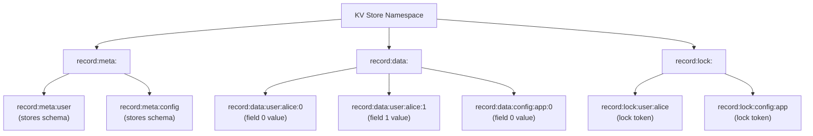
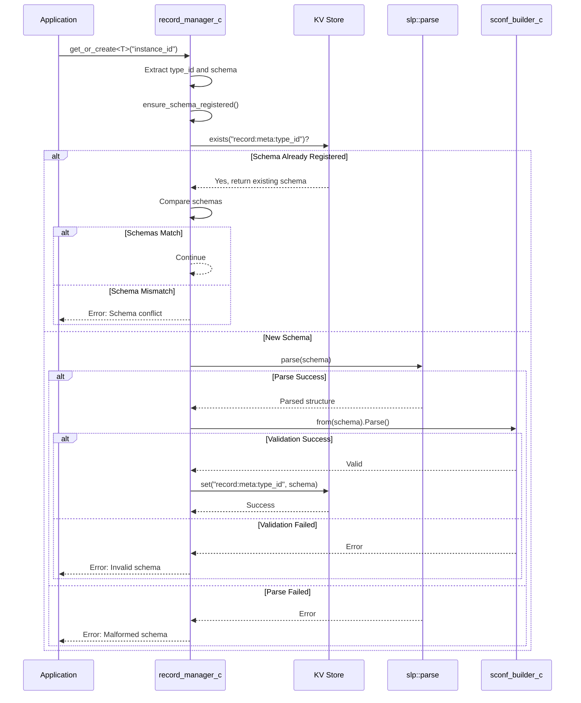
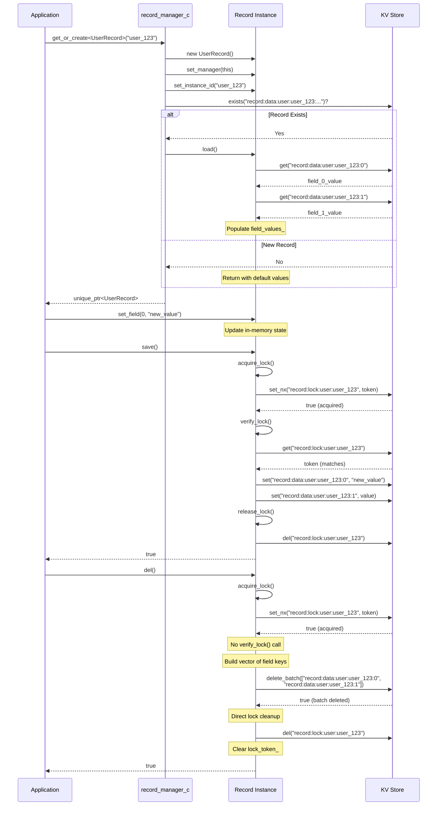
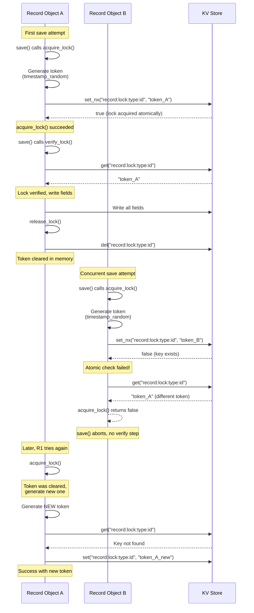
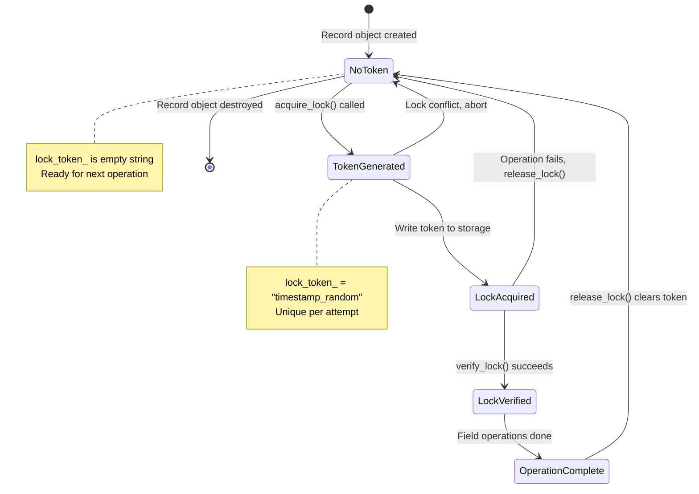
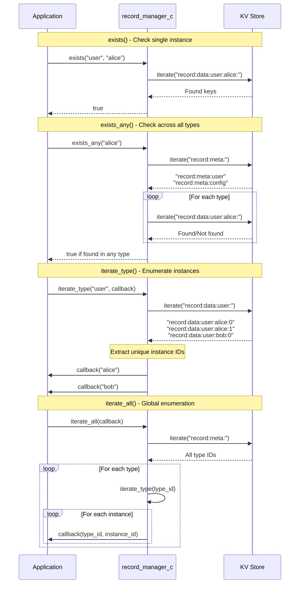
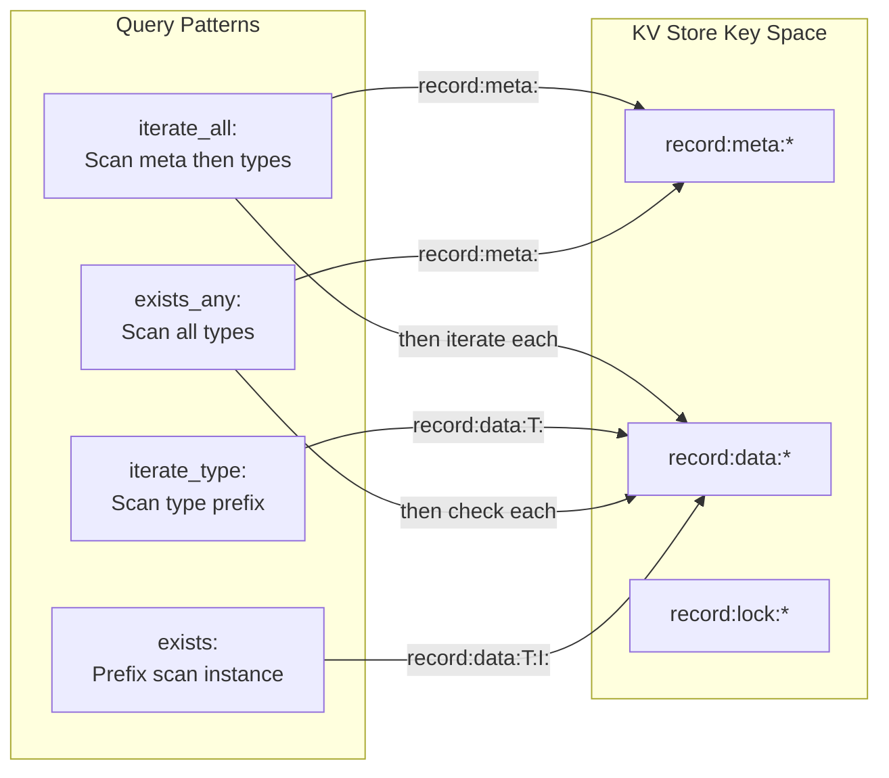

# Record: Structured Data Persistence System

## Package Overview

The record package provides a framework for defining, managing, and persisting structured data types within the system. It enables applications to work with strongly-typed records that are automatically validated against schemas and persisted to key-value storage. The package acts as a bridge between application-level data structures and the underlying kvds storage layer, handling serialization, schema validation, concurrency control, and lifecycle management.

Records in this system are identified by a combination of type identifier and instance identifier. The type identifier represents the record's schema or class, while the instance identifier uniquely identifies a particular instance of that type. This two-level identification scheme allows multiple instances of the same record type to coexist while maintaining clear separation between different record types.

The record package integrates tightly with the sconf schema definition system and the slp parsing library to provide compile-time type safety combined with runtime schema validation. It leverages the kvds package for all storage operations, providing a higher-level abstraction that handles the complexities of distributed field storage, locking, and consistency.

## Core Architecture

The package defines a three-tier architecture consisting of interfaces, management infrastructure, and base implementations. At the interface level, record_if defines the contract that all record types must satisfy. This interface exposes methods for field access, persistence operations, and metadata retrieval. The interface is designed to be implemented by application-specific record types that define their own schemas and field structures.

The record_manager_c component serves as the central orchestrator for all record operations within the system. It acts as a factory for creating record instances, manages schema registration and validation, provides existence checking and iteration capabilities, and maintains the namespace structure within the underlying key-value store. The manager is the sole entry point for creating records and ensures consistency between schema definitions and stored data.

The record_base_c class provides a concrete base implementation of the record_if interface that handles common functionality shared across all record types. This includes the complete save and delete operations, lock acquisition and verification logic, instance identification management, and field storage. Application record types inherit from record_base_c and implement only the schema-specific methods related to field definitions and load operations.

## Storage Architecture

Records are persisted to the underlying kvds key-value store using a structured key namespace that enables efficient querying and isolation. The storage system uses three distinct key prefixes to organize different categories of data.

Schema metadata is stored under keys with the prefix "record:meta:" followed by the type identifier. Each schema key contains the complete schema definition as its value, allowing the system to validate schema consistency across restarts and detect incompatible schema changes. Only one schema can exist per type identifier, and attempting to register a different schema for an existing type results in an error.

Record field data is stored under keys with the prefix "record:data:" followed by the type identifier, instance identifier, and field index. Each field of a record instance is stored as a separate key-value pair, with the value being the field's serialized string representation. This field-level granularity allows for efficient partial updates and enables the storage of records with arbitrary field counts without requiring fixed-size storage allocations.

Locking state is maintained under keys with the prefix "record:lock:" followed by the type identifier and instance identifier. Lock keys store lock tokens that identify the current holder of a lock on a record instance. These locks provide optimistic concurrency control to prevent conflicting concurrent modifications to the same record instance.

### Storage Key Structure

## Schema Management

The record system enforces schema validation through integration with the sconf configuration system. Every record type must provide a schema definition that describes its structure, field types, and constraints. When a record manager encounters a new type identifier, it validates the schema and registers it in the metadata storage before allowing any operations on records of that type.

Schema validation occurs in two phases. First, the schema string is parsed using the slp parser to verify syntactic correctness. This ensures the schema is well-formed and can be processed by the sconf system. Second, the schema is validated by the sconf configuration builder which checks type correctness, constraint validity, and structural integrity.

Once a schema is successfully validated and stored, it becomes the canonical definition for that record type. All subsequent attempts to create records of that type must provide an identical schema. This strict schema immutability prevents data corruption that could arise from schema evolution without migration. If schema changes are needed, applications must implement their own migration logic, potentially using a new type identifier for the evolved schema.

The schema registration process is idempotent. If a schema is already registered for a type identifier, the manager verifies that the provided schema exactly matches the existing schema. This allows multiple components to safely attempt registration of the same record type without coordination, as long as they agree on the schema definition.

### Schema Validation Flow

## Record Lifecycle

Record instances progress through a well-defined lifecycle managed by the record_manager_c. The lifecycle begins when an application requests a record through the manager's get_or_create method, providing the desired instance identifier. This method is templated on the record type, enabling type-safe creation while allowing the manager to work with records through the common record_if interface.

When get_or_create is invoked, the manager first instantiates a new object of the requested type and extracts its type identifier and schema definition. It then ensures the schema is registered, failing the operation if schema validation or registration fails. The manager configures the record instance by setting its manager reference and instance identifier, establishing the bidirectional relationship needed for the record to perform storage operations.

The manager then checks whether data already exists for the specified instance identifier under the given type. If existing data is found, the manager invokes the record's load method which retrieves all field values from storage and populates the record's in-memory state. If no existing data is found, the record is returned in its initial state, ready to have fields set and then saved.

Throughout its active lifetime, a record instance can be read from and written to through its field accessor methods. These accessors operate on in-memory state and do not trigger storage operations. When changes need to be persisted, the application explicitly invokes the save method which writes all field values to storage atomically under lock protection.

When a record is no longer needed, the application can delete it from storage by calling the del method, or simply allow the record object to go out of scope if persistence is desired. Record objects do not maintain long-lived locks or require explicit cleanup beyond normal object destruction.

### Record Lifecycle Diagram

## Concurrency Control

The record system implements optimistic locking to prevent conflicting concurrent modifications to the same record instance. The locking mechanism is transparent to most operations but provides critical safety guarantees when multiple components may access the same record.

Each record instance generates a unique lock token when it attempts to acquire a lock. The token combines a high-resolution timestamp with a cryptographically random value, making collision virtually impossible even across multiple processes and hosts. This token is generated fresh for each operation sequence and is cleared after the operation completes.

When a record needs to perform a mutating operation such as save or delete, it first attempts to acquire a lock by writing its token to the lock key in storage. The acquire_lock method uses the atomic set_nx operation provided by the kvds layer to perform an atomic set-if-not-exists on the lock key. This operation succeeds only if no lock currently exists, eliminating the race condition that would exist with separate read-then-write operations. If the lock is successfully created with the record's token, the acquisition succeeds immediately. If a lock already exists, the method checks whether it contains this record's own token, enabling multiple operations from the same record object without lock contention.

If a lock exists with a different token, the acquisition fails and the operation is aborted. This indicates another record object currently holds the lock on that instance, and concurrent modification is not safe. The application must retry the operation later or handle the conflict according to its business logic.

The save operation uses a two-phase locking pattern: after acquiring the lock, it calls verify_lock to confirm the lock is still held before writing field data. While the atomic set_nx primitive eliminates the primary race condition in lock acquisition, the verification step provides an additional safety check before committing field modifications. The del operation, in contrast, uses only acquire_lock without verification since it deletes the entire record and performs direct lock cleanup rather than calling release_lock.

The use of atomic set_nx for lock acquisition makes the record system safe for distributed and multi-process scenarios. Multiple processes can safely attempt to acquire locks on the same record instance, with the kvds layer ensuring only one succeeds atomically.

After completing a mutating operation, the record releases its lock. The save operation calls release_lock which deletes the lock key from storage and clears the in-memory lock token. The del operation performs direct cleanup by deleting the lock key and clearing the token inline rather than calling release_lock. Both approaches ensure that even if an operation fails partway through, locks do not leak and deadlock the system. Subsequent operations will generate a fresh lock token, preventing token reuse across operations.

The record manager performs lock cleanup during initialization, scanning for and removing all existing locks in the system. This recovery mechanism handles cases where locks were not properly released due to crashes or abnormal termination, ensuring a clean starting state.

### Lock Acquisition Flow

### Lock Token Lifecycle

## Field Storage Model

Individual record types define their fields and the mapping between field indices and field values. The record_base_c class maintains a field_values_ vector that stores the string representation of each field in index order. Derived record classes are responsible for serializing and deserializing their native field types to and from these string representations.

The save operation iterates through all fields in index order, constructing a storage key for each field and writing its string value to the key-value store. This field-by-field approach means each field is written in a separate storage operation. While this provides granularity, it also means save operations must acquire a lock to ensure consistency across all field writes.

The load operation, which must be implemented by derived record classes, performs the inverse transformation. It retrieves each field's string value from storage using the field index, then deserializes the string into the appropriate native type for that field. Load operations do not require locks as they are read-only and operate on a consistent snapshot provided by the underlying storage layer.

The delete operation removes all field keys for the record instance along with its lock key if present. The operation first builds a vector of all field keys, then uses the kvds delete_batch method to remove them atomically in a single operation. This is more efficient than individual deletions, especially for disk-backed stores where RocksDB can batch the deletions into a single write operation. The del operation executes under lock protection to prevent concurrent modification attempts from interfering with deletion, but unlike save, del uses only acquire_lock without the subsequent verify_lock step since it is deleting the entire record. After deleting all field keys, del performs direct cleanup by deleting the lock key and clearing the lock token, rather than calling the release_lock helper method.

## Query Capabilities

The record system provides several methods for discovering and iterating over stored records beyond simple existence checks. These query capabilities enable applications to enumerate records without knowing all instance identifiers in advance.

The exists method checks whether a specific record instance exists by searching for any keys matching that instance's storage prefix. It uses the efficient prefix iteration provided by kvds to quickly determine presence without retrieving all field values. The exists_any variant searches across all registered record types to determine if any record exists with the given instance identifier, regardless of type.

The iterate_type method enables enumeration of all instances of a particular record type. It scans the storage keys under that type's data prefix and extracts unique instance identifiers from the key structure. The method invokes a callback for each discovered instance identifier, allowing early termination if the callback returns false. This supports patterns like searching for specific instances or collecting a limited result set.

The iterate_all method provides global enumeration across all record types and instances in the system. It first iterates over all registered schemas to discover type identifiers, then for each type iterates over all instances of that type. The callback receives both the type identifier and instance identifier, enabling comprehensive traversal of the entire record space.

These iteration methods leverage the structured key namespace and the prefix-based iteration capabilities of the underlying kvds system. They are consistent with concurrent modifications, though they may see a snapshot that includes partially completed operations depending on the timing of lock acquisition and release.

### Query Operations Flow

### Key Namespace Structure

## Integration Points

Schema validation integrates with both the slp parsing library and the sconf configuration system. Schemas are defined using the slp syntax and must be parseable by slp::parse. The parsed schema is then validated through sconf_builder_c to ensure semantic correctness and type system consistency. This two-phase validation provides robust error detection and clear failure messages.

The record package uses spdlog for all logging operations. Each record manager receives a logger during construction which it uses to log initialization events, schema validation results, errors, and debugging information. The logger integration allows applications to control logging verbosity and routing according to their operational requirements.

Record types themselves are defined by application code that inherits from record_base_c and implements the required interface methods. This inversion of control allows the record package to provide infrastructure while applications define schemas, types, and domain-specific behavior. The template-based factory pattern in get_or_create maintains type safety across this boundary.

## Key Features

### Type-Safe Record Creation

The record manager's get_or_create method uses C++ templates to provide compile-time type checking while working with records through a runtime interface. Applications request specific record types at compile time, and the template instantiation ensures only types inheriting from record_if can be created. This prevents incorrect types from entering the system while avoiding the overhead and limitations of runtime type identification.

### Automatic Schema Validation

Every record type must define its schema, and that schema is automatically validated before any operations occur. This validation happens transparently during the first interaction with each record type, ensuring data integrity from the start. Applications receive clear error messages if schemas are malformed or incompatible with existing registered schemas, making debugging straightforward.

### Instance Identifier Flexibility

The system places no constraints on instance identifier format or generation strategy. Applications can use UUIDs, sequential integers, composite keys, or any other string-based identifier scheme that fits their domain model. The record system treats instance identifiers as opaque strings and uses them only for storage key construction and equality comparison.

### Optimistic Concurrency Control

The lock token mechanism provides safety against concurrent modifications without requiring long-held locks or complex coordination protocols. Records acquire locks only during actual mutation operations and release them immediately after, minimizing contention. The token-based approach naturally handles distributed scenarios where multiple processes may access the same underlying storage.

### Extensible Field Serialization

While the storage layer works with string representations of field values, the record system does not dictate how native types are serialized to strings. Derived record classes implement their own serialization logic appropriate to their field types. This allows for human-readable serialization for debugging, compact binary encoding for efficiency, or any other format the application requires.

### Comprehensive Discovery

The iteration and existence checking capabilities allow applications to treat the record system as a queryable data store rather than just a simple persistence layer. Applications can enumerate records by type, search for specific instances, or scan the entire record space. These capabilities support use cases like administrative tools, debugging interfaces, and migration utilities.

