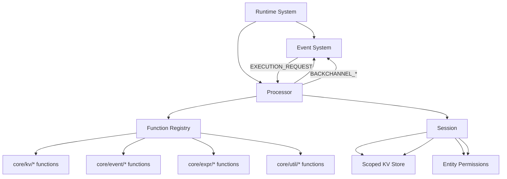
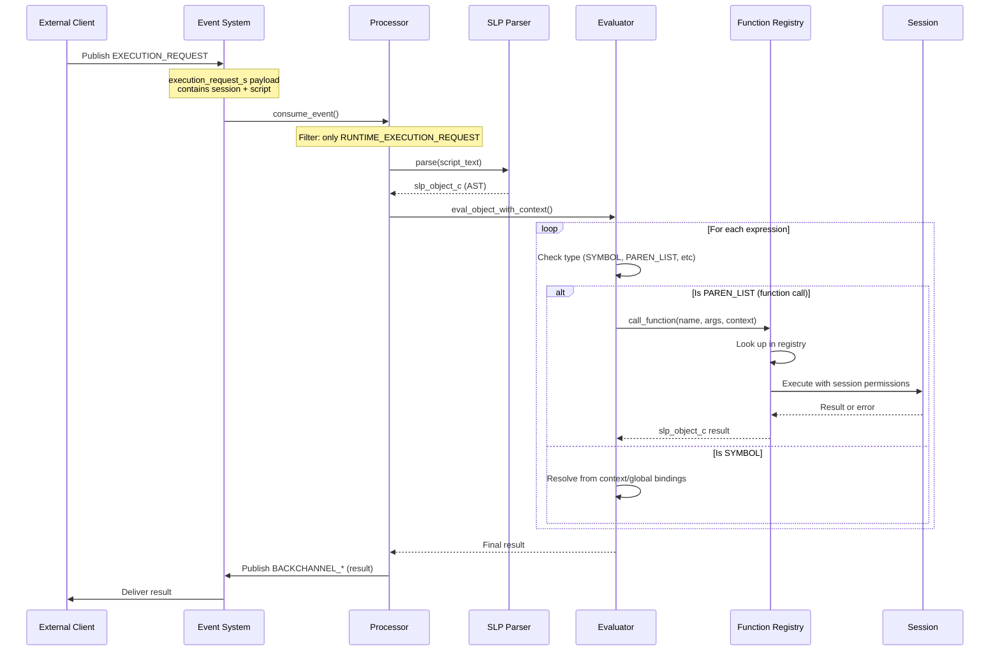
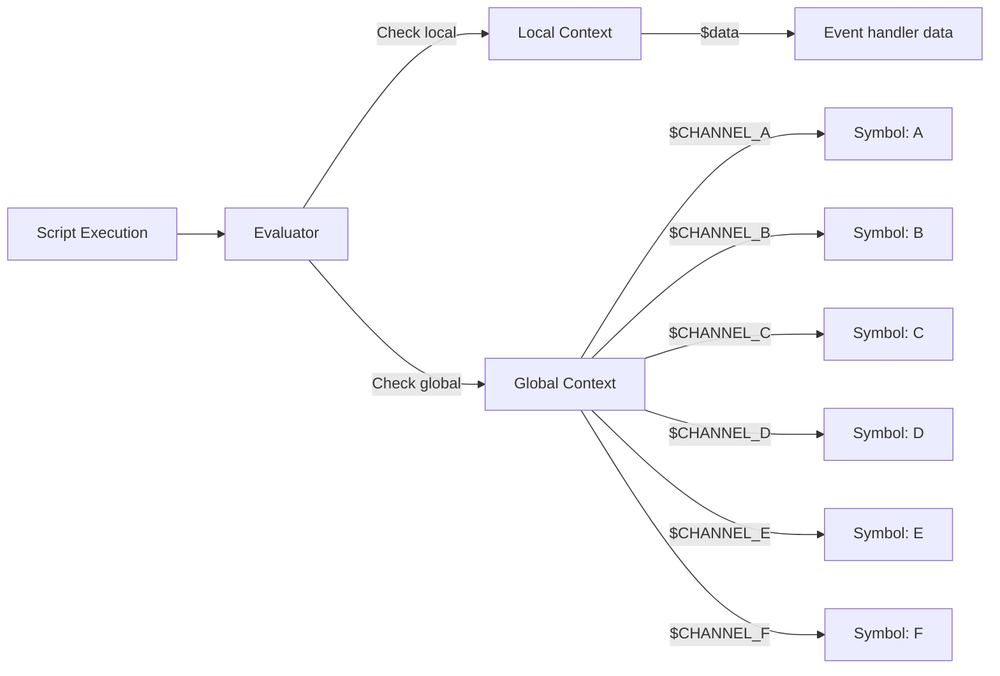
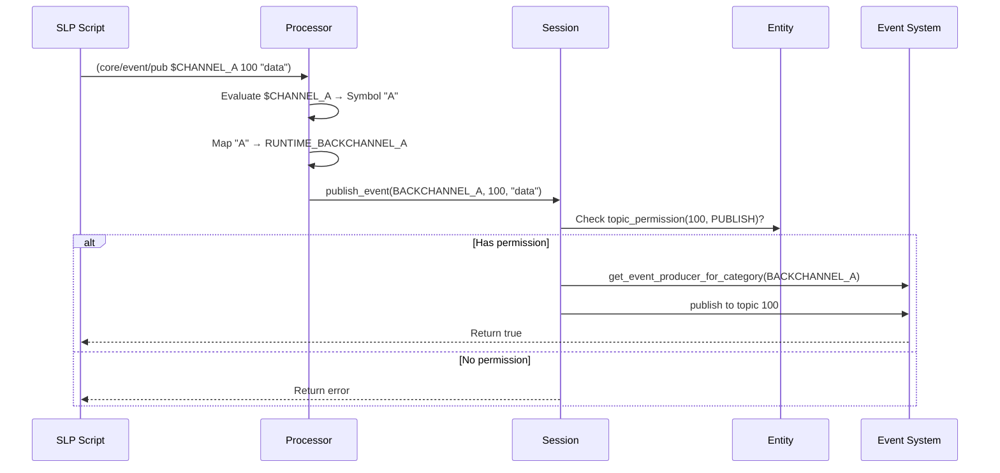
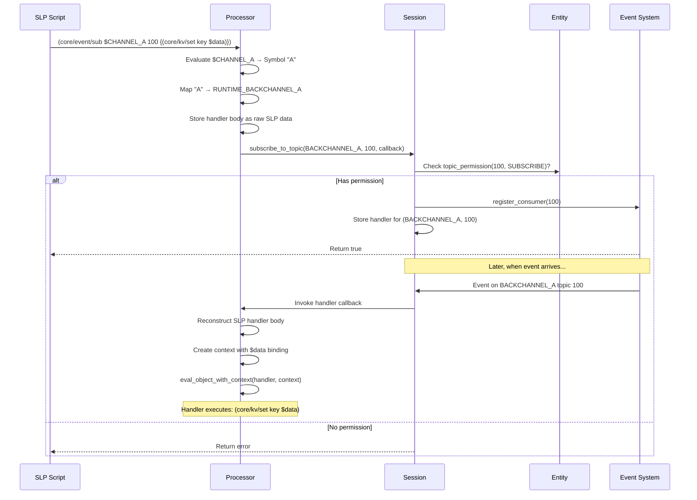
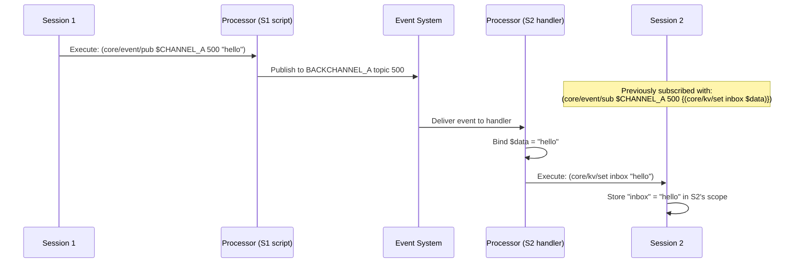

# Runtime System

## Overview

The runtime provides an event-driven execution environment with:
- Permission-based data storage through entities and sessions
- Script execution via the processor (SLP - Simple Lisp-like Parser)
- Event-driven pub/sub messaging system
- Isolated execution contexts per session

## Core Components

### Entities & Sessions

- **Datastores**: Persistent key-value storage using RocksDB
- **Records**: Persistent records of entities stored in datastores
- **Entities**: Permission holders with read/write access to KV scopes and event topics
- **Sessions**: Runtime instances of entities working within a specific scope
- **Scoping**: Sessions mask scoping to provide data isolation between entities
- **Control**: Maximum number of sessions per-entity as a control specifier

### Processor System

The processor is an event-driven script execution engine that:
- Parses and executes SLP (Simple Lisp-like Parser) scripts
- Provides a function registry for extensible commands
- Integrates with session-based permissions
- Enables dynamic pub/sub event handling
- Supports context-based symbol resolution
- Filters events by category (only processes RUNTIME_EXECUTION_REQUEST)
- Supports multiple processor instances for concurrent execution

## Processor Architecture



## Processor Execution Flow



## Multi-Processor Architecture

The runtime supports multiple processor instances for concurrent script execution:

### Configuration

Set `num_processors` in `options_s` (minimum: 1, default: 1):
- With 1 processor: Single processor consumes topic 0
- With 4 processors: Four processors consume topics 0, 1, 2, 3

### Topic Distribution

Each processor is registered as a consumer on a specific topic:

```
Processor 0 → Topic 0
Processor 1 → Topic 1
Processor 2 → Topic 2
...
Processor N-1 → Topic N-1
```

### Load Distribution

Execution requests are distributed by publishing to different topics:

```cpp
// Publish to processor 0
event.topic_identifier = 0;

// Publish to processor 2
event.topic_identifier = 2;
```

### Benefits

- **Concurrent Execution**: Multiple scripts execute in parallel
- **Load Balancing**: Distribute execution across processors
- **Isolation**: Each processor operates independently
- **Scalability**: Add more processors for higher throughput

## Function Calling System

### Function Registry

Functions are registered at processor initialization with this signature:

```cpp
using function_handler_t = std::function<slp::slp_object_c(
    session_c *session,
    const slp::slp_object_c &args,
    const eval_context_s &context
)>;
```

### Built-in Functions

#### KV Operations
- `(core/kv/set key value)` - Set a key-value pair in scoped store
- `(core/kv/get key)` - Get a value by key
- `(core/kv/del key)` - Delete a key
- `(core/kv/exists key)` - Check if key exists

#### Event Operations
- `(core/event/pub $CHANNEL_X topic-id data)` - Publish event to specified channel
- `(core/event/sub $CHANNEL_X topic-id {handler})` - Subscribe to events on channel
  - Handler body receives `$data` binding with event payload
  - Handler executes as bracket list `[]` of statements

#### Expression Operations
- `(core/expr/eval script-text)` - Evaluate script dynamically
- `(core/expr/await body response-channel response-topic)` - Execute with await on response

#### Utility Operations
- `(core/util/log message ...)` - Log messages from scripts

### Evaluation Context



### Symbol Resolution

When evaluating a symbol:
1. Check local context (e.g., `$data` in event handlers)
2. Check global context (e.g., `$CHANNEL_A`)
3. Return symbol as-is if not found (literal)

## Event Pub/Sub Through Processor

### Publishing Events



### Subscribing to Events



## Channel System

### Channel Identifiers

The processor provides 6 global channel identifiers:

| Identifier | Maps To | Event Category |
|------------|---------|----------------|
| `$CHANNEL_A` | `"A"` | `RUNTIME_BACKCHANNEL_A` |
| `$CHANNEL_B` | `"B"` | `RUNTIME_BACKCHANNEL_B` |
| `$CHANNEL_C` | `"C"` | `RUNTIME_BACKCHANNEL_C` |
| `$CHANNEL_D` | `"D"` | `RUNTIME_BACKCHANNEL_D` |
| `$CHANNEL_E` | `"E"` | `RUNTIME_BACKCHANNEL_E` |
| `$CHANNEL_F` | `"F"` | `RUNTIME_BACKCHANNEL_F` |

### Channel Isolation

Channels provide logical separation on the same topic:

```slp
; Subscribe to topic 500 on channel A
(core/event/sub $CHANNEL_A 500 {
  (core/util/log "Got event on channel A:" $data)
})

; Subscribe to the SAME topic 500 on channel B
(core/event/sub $CHANNEL_B 500 {
  (core/util/log "Got event on channel B:" $data)
})

; Publish to channel A - only first handler receives it
(core/event/pub $CHANNEL_A 500 "message for A")

; Publish to channel B - only second handler receives it
(core/event/pub $CHANNEL_B 500 "message for B")
```

## Error Handling

### Error Types

All functions return `slp::slp_object_c` which can be:
- Regular value (INTEGER, REAL, STRING, SYMBOL, etc.)
- ERROR type with error message

### Error Propagation

```slp
; Errors stop execution in bracket lists
[
  (core/kv/set "key1" "value1")    ; Succeeds
  (core/kv/get "nonexistent")       ; Returns ERROR
  (core/kv/set "key2" "value2")    ; Not executed due to error
]
```

### Permission Errors

```slp
; If entity lacks PUBLISH permission on topic 100:
(core/event/pub $CHANNEL_A 100 "data")
; Returns: @"core/event/pub failed (check permissions)"

; If entity lacks SUBSCRIBE permission on topic 200:
(core/event/sub $CHANNEL_A 200 {(core/util/log $data)})
; Returns: @"core/event/sub failed (check permissions)"
```

## Example Script Execution

### Complete Workflow

```slp
[
  ; Store some data
  (core/kv/set "user_count" "42")
  (core/kv/set "status" "active")
  
  ; Set up event handler
  (core/event/sub $CHANNEL_A 100 {
    (core/kv/set "last_event" $data)
    (core/util/log "Received event:" $data)
  })
  
  ; Publish test event
  (core/event/pub $CHANNEL_A 100 "test message")
  
  ; Query data
  (core/kv/get "user_count")  ; Returns "42"
]
```

### Inter-Session Communication



## Thread Safety

- Function registry: Read-only after initialization
- Subscription handlers: Protected by `subscription_handlers_mutex_`
- Session operations: Thread-safe through underlying stores
- Event system: Thread-safe queue with worker threads

## Extension Points

### Adding New Functions

```cpp
processor.register_function("my/func", 
  [](session_c *session, const slp::slp_object_c &args, const eval_context_s &context) {
    // Parse arguments
    auto list = args.as_list();
    if (list.size() < 2) {
      return SLP_ERROR("my/func requires an argument");
    }
    
    // Execute logic
    auto arg = list.at(1);
    
    // Return result
    return SLP_STRING("result");
  }
);
```

Functions have full access to:
- Session and its permissions
- Evaluation context with bindings
- Event system through session
- Scoped KV store through session

### Custom Symbol Bindings

```cpp
global_context_.bindings["$MY_CONST"] = slp::parse("42").take();
```

## Performance Considerations

- SLP parsing: O(n) in script size
- Function dispatch: O(1) hash map lookup
- Symbol resolution: O(1) map lookup in context, then global
- Event handlers: Stored as pre-parsed SLP data, reconstructed on invocation
- Permission checks: O(1) map lookup per operation