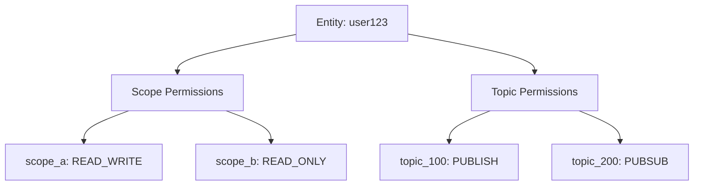
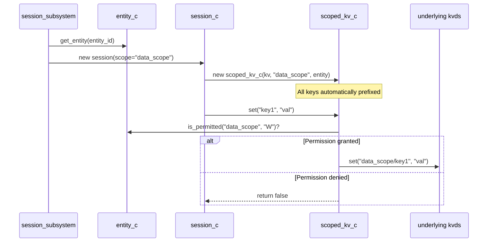
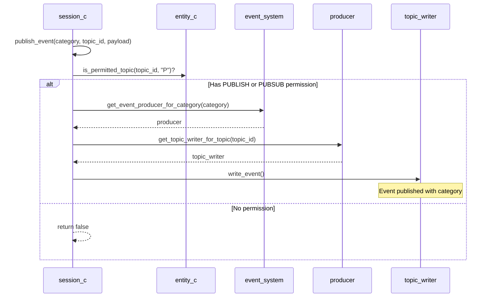

# Session System Architecture

## Overview

The session system provides permission-based resource access control through the combination of persistent entities and ephemeral sessions. Entities hold long-term permissions for both KV store scopes and event system topics, while sessions enforce these permissions at runtime for every operation.

## Core Components

### Entity (`entity_c`)

Persistent permission holder that maintains two independent permission maps:

- **Scope Permissions**: Control access to KV store namespaces
  - `READ_ONLY` ("R"): Read operations only
  - `WRITE_ONLY` ("W"): Write operations only
  - `READ_WRITE` ("RW"): Full read/write access

- **Topic Permissions**: Control event system participation
  - `PUBLISH` ("P"): Can publish events to topic
  - `SUBSCRIBE` ("S"): Can subscribe to topic events
  - `PUBSUB` ("PS"): Both publish and subscribe

### Session (`session_c`)

Temporary runtime context that links an entity, a scope, and the event system:

- Creates a scoped KV store wrapper at construction
- Validates entity permissions on every operation
- Enables dynamic event category selection per publish
- Returns `false` on permission denial (fail silently)

### Scoped KV Store (`scoped_kv_c`)

Permission-enforcing wrapper around the underlying `kvds::kv_c`:

- Automatically prefixes all keys with scope name (e.g., `"my_scope/key1"`)
- Checks entity permissions before each operation
- Isolates different scopes from each other
- Transparently handles key prefixing/unprefixing

## Permission Flow Diagrams

### Entity Permission Structure



### Session Creation & KV Scoping



### Event Permission Flow



## Key Behaviors

### KV Store Isolation

- Sessions see ONLY their scope prefix
- Key `"user_data"` becomes `"my_scope/user_data"` in underlying store
- Different sessions with different scopes cannot interfere
- Permission checks happen before EVERY operation

### Event System Filtering

- Topic permissions checked on publish AND subscribe
- Category can be dynamically chosen per event
- Permissions stored persistently in entity
- Failed operations return false (fail silently)
- Unsubscribing removes handler and consumer reference from session
- Note: Consumer remains registered in event system (no unregister API), but won't be invoked

### Session Lifecycle

- Created with `entity_id` + `scope`
- Scope permissions NOT validated at creation time
- Operations fail at runtime if permissions missing
- Sessions can be created for any scope regardless of entity permissions

## Code Examples

### Example 1: Scope Permission Setup

```cpp
entity->grant_permission("user_data", permission::READ_WRITE);
entity->grant_permission("config", permission::READ_ONLY);
entity->save();
```

### Example 2: Session with Scoped Access

```cpp
auto session = subsystem.create_session("user123", "user_data");
auto* store = session->get_store();

store->set("preferences", "dark_mode");

auto session2 = subsystem.create_session("user123", "config");
auto* store2 = session2->get_store();
store2->set("key", "val");
```

Note: If entity "user123" only has READ_ONLY permission to "config" scope (as shown in Example 1), the `store2->set()` call will return `false`.

### Example 3: Event Publishing

```cpp
entity->grant_topic_permission(100, topic_permission::PUBLISH);
entity->save();

auto session = subsystem.create_session("user123", "data");

session->publish_event(event_category_e::RUNTIME_BACKCHANNEL_A, 100, data);

session->publish_event(event_category_e::RUNTIME_BACKCHANNEL_A, 200, data);
```

## Design Rationale

### Why separate Entity and Session?

- **Entity**: Persistent, shared across sessions, manages long-term permissions
- **Session**: Ephemeral, runtime context, enforces permissions

### Why fail silently (return false)?

- Caller can check return value
- No exceptions in hot path
- Consistent error handling pattern

### Why check permissions at operation time?

- Allows dynamic permission changes
- Simpler session creation
- No need to validate all possible operations upfront

## Permission Matrix

| Operation | Requires Scope Permission | Requires Topic Permission |
|-----------|--------------------------|--------------------------|
| `store->get()` | READ_ONLY or READ_WRITE | N/A |
| `store->set()` | WRITE_ONLY or READ_WRITE | N/A |
| `session->publish_event()` | N/A | PUBLISH or PUBSUB |
| `session->subscribe_to_topic()` | N/A | SUBSCRIBE or PUBSUB |

