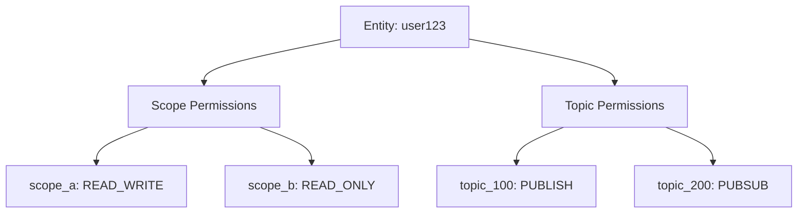
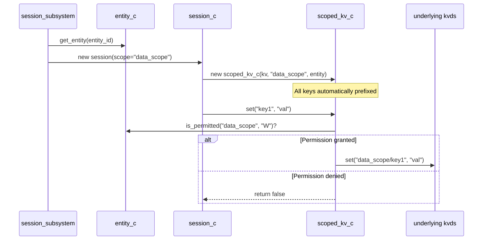
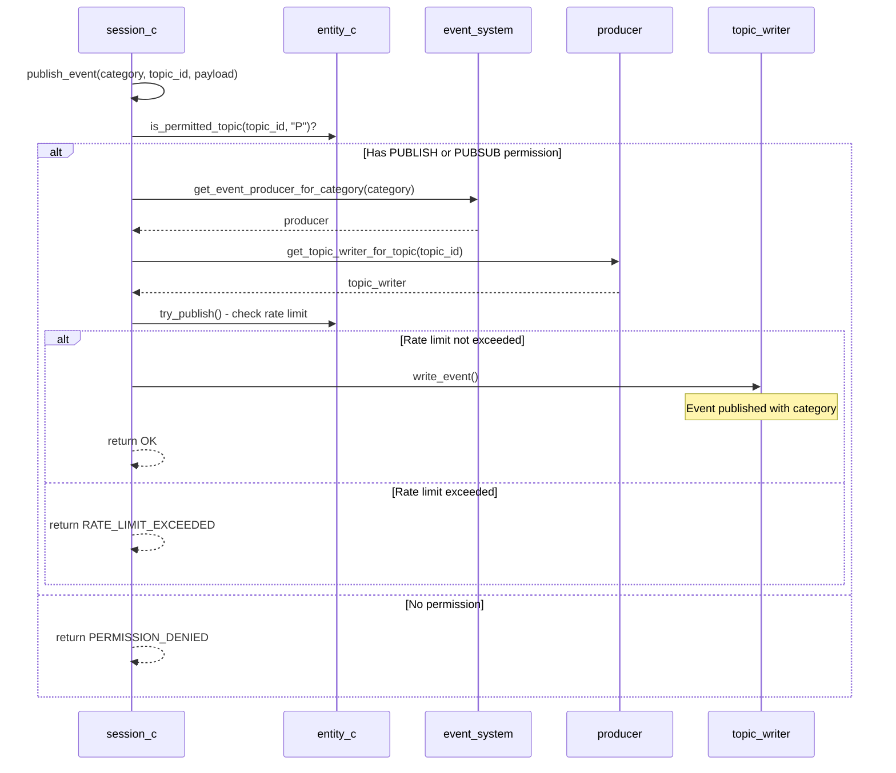
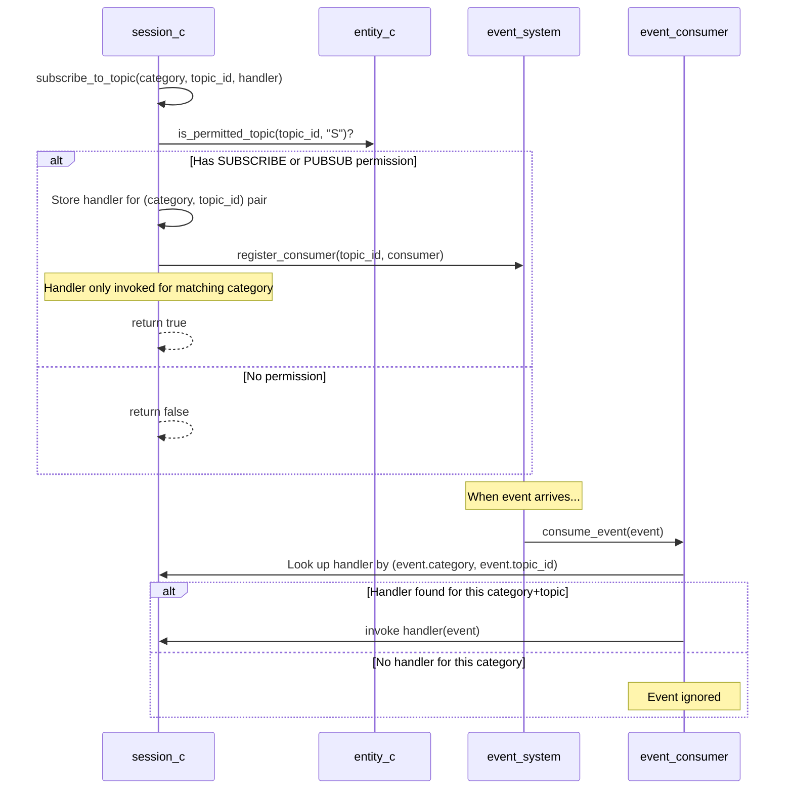

# Session System Architecture

## Overview

The session system provides permission-based resource access control through the combination of persistent entities and ephemeral sessions. Entities hold long-term permissions for both KV store scopes and event system topics, while sessions enforce these permissions at runtime for every operation.

## Core Components

### Entity (`entity_c`)

Persistent permission holder that maintains two independent permission maps and rate limiting:

- **Scope Permissions**: Control access to KV store namespaces
  - `READ_ONLY` ("R"): Read operations only
  - `WRITE_ONLY` ("W"): Write operations only
  - `READ_WRITE` ("RW"): Full read/write access

- **Topic Permissions**: Control event system participation
  - `PUBLISH` ("P"): Can publish events to topic
  - `SUBSCRIBE` ("S"): Can subscribe to topic events
  - `PUBSUB` ("PS"): Both publish and subscribe

- **Rate Limiting**: Controls event publishing frequency
  - `max_rps`: Maximum events per second (0 = unlimited)
  - Enforced via sliding window of timestamps
  - Applies to all event publishing operations

### Session (`session_c`)

Temporary runtime context that links an entity, a scope, and the event system:

- Creates a scoped KV store wrapper at construction
- Validates entity permissions on every operation
- Enables dynamic event category selection per publish
- Returns detailed `publish_result_e` from event publishing operations
- Returns `false` from KV operations on permission denial (fail silently)

### Scoped KV Store (`scoped_kv_c`)

Permission-enforcing wrapper around the underlying `kvds::kv_c`:

- Automatically prefixes all keys with scope name (e.g., `"my_scope/key1"`)
- Checks entity permissions before each operation
- Isolates different scopes from each other
- Transparently handles key prefixing/unprefixing

## Permission Flow Diagrams

### Entity Permission Structure



### Session Creation & KV Scoping



### Event Permission Flow

#### Publishing Events



#### Subscribing to Events



## Key Behaviors

### KV Store Isolation

- Sessions see ONLY their scope prefix
- Key `"user_data"` becomes `"my_scope/user_data"` in underlying store
- Different sessions with different scopes cannot interfere
- Permission checks happen before EVERY operation

### Event System Filtering

- Topic permissions checked on publish AND subscribe
- Category can be dynamically chosen per event
- **Subscriptions are category-specific**: `subscribe_to_topic(category, topic_id, handler)` only receives events matching both the category and topic_id
- Events published to a different category on the same topic will not trigger the handler
- Permissions stored persistently in entity (topic permissions only, not category-specific)
- Failed operations return false (fail silently)
- Unsubscribing requires both category and topic_id: `unsubscribe_from_topic(category, topic_id)`
- Note: Consumer remains registered in event system (no unregister API), but won't be invoked

### Rate Limiting

- Entity-level rate limiting controls event publishing frequency
- Configured via `entity->set_max_rps(count)` (0 = unlimited)
- Uses sliding window algorithm tracking timestamps over 1 second
- Rate limit checked AFTER permission check but BEFORE event write
- Returns `RATE_LIMIT_EXCEEDED` when limit exceeded
- Rate limit applies to all topics for a given entity
- Timestamps automatically cleaned up (events older than 1 second removed)

### Publish Result Types

Event publishing returns `publish_result_e` with the following values:

- `OK`: Event successfully published
- `RATE_LIMIT_EXCEEDED`: Entity max_rps limit exceeded
- `PERMISSION_DENIED`: Entity lacks PUBLISH or PUBSUB permission
- `NO_ENTITY`: Session has no associated entity
- `NO_EVENT_SYSTEM`: Event system not available
- `NO_PRODUCER`: Event producer not found for category
- `NO_TOPIC_WRITER`: Topic writer not found for topic_id

### Session Lifecycle

- Created with `entity_id` + `scope`
- Scope permissions NOT validated at creation time
- Operations fail at runtime if permissions missing
- Sessions can be created for any scope regardless of entity permissions

### Category-Scoped Event Subscriptions

- Subscriptions are identified by `(category, topic_id)` pairs
- Multiple subscriptions to the same `topic_id` but different categories are independent
- Example: Subscribing to `(BACKCHANNEL_A, 100)` will NOT receive events published to `(BACKCHANNEL_B, 100)`
- This enables category-based event routing without requiring separate topic IDs
- Topic permissions remain category-agnostic (one permission grants access to a topic across all categories)

## Code Examples

### Example 1: Scope Permission Setup

```cpp
entity->grant_permission("user_data", permission::READ_WRITE);
entity->grant_permission("config", permission::READ_ONLY);
entity->save();
```

### Example 2: Session with Scoped Access

```cpp
auto session = subsystem.create_session("user123", "user_data");
auto* store = session->get_store();

store->set("preferences", "dark_mode");

auto session2 = subsystem.create_session("user123", "config");
auto* store2 = session2->get_store();
store2->set("key", "val");
```

Note: If entity "user123" only has READ_ONLY permission to "config" scope (as shown in Example 1), the `store2->set()` call will return `false`.

### Example 3: Event Publishing & Subscribing

```cpp
// Grant permissions
entity->grant_topic_permission(100, topic_permission::PUBSUB);
entity->grant_topic_permission(200, topic_permission::PUBLISH);
entity->save();

auto session = subsystem.create_session("user123", "data");

// Publish to BACKCHANNEL_A on topic 100
session->publish_event(event_category_e::RUNTIME_BACKCHANNEL_A, 100, data);

// Subscribe to BACKCHANNEL_A on topic 100
session->subscribe_to_topic(
    event_category_e::RUNTIME_BACKCHANNEL_A, 
    100, 
    [](const event_s& event) {
    }
);

// Publish to topic 200 (entity has PUBLISH permission)
session->publish_event(event_category_e::RUNTIME_BACKCHANNEL_A, 200, data);

// Unsubscribe from specific category+topic combination
session->unsubscribe_from_topic(event_category_e::RUNTIME_BACKCHANNEL_A, 100);
```

### Example 4: Rate Limiting

```cpp
entity->grant_topic_permission(100, topic_permission::PUBLISH);
entity->set_max_rps(10);
entity->save();

auto session = subsystem.create_session("user123", "data");

for (int i = 0; i < 15; i++) {
    auto result = session->publish_event(
        event_category_e::RUNTIME_BACKCHANNEL_A, 
        100, 
        "data"
    );
    
    if (result == publish_result_e::OK) {
    } else if (result == publish_result_e::RATE_LIMIT_EXCEEDED) {
    }
}

entity->set_max_rps(0);
entity->save();
```

### Example 5: Category-Scoped Subscription Isolation

```cpp
entity->grant_topic_permission(500, topic_permission::PUBSUB);
entity->save();

auto session = subsystem.create_session("user123", "data");

std::atomic<int> channel_a_count{0};
std::atomic<int> channel_b_count{0};

session->subscribe_to_topic(
    event_category_e::RUNTIME_BACKCHANNEL_A, 
    500, 
    [&](const event_s& event) { channel_a_count++; }
);

session->subscribe_to_topic(
    event_category_e::RUNTIME_BACKCHANNEL_B, 
    500, 
    [&](const event_s& event) { channel_b_count++; }
);

session->publish_event(event_category_e::RUNTIME_BACKCHANNEL_A, 500, "data1");

session->publish_event(event_category_e::RUNTIME_BACKCHANNEL_B, 500, "data2");
```

## Design Rationale

### Why separate Entity and Session?

- **Entity**: Persistent, shared across sessions, manages long-term permissions
- **Session**: Ephemeral, runtime context, enforces permissions

### Why fail silently (return false)?

- Caller can check return value
- No exceptions in hot path
- Consistent error handling pattern

### Why check permissions at operation time?

- Allows dynamic permission changes
- Simpler session creation
- No need to validate all possible operations upfront

## Permission Matrix

| Operation | Signature | Requires Scope Permission | Requires Topic Permission | Rate Limited |
|-----------|-----------|--------------------------|--------------------------|--------------|
| `store->get()` | `get(key)` | READ_ONLY or READ_WRITE | N/A | No |
| `store->set()` | `set(key, value)` | WRITE_ONLY or READ_WRITE | N/A | No |
| `session->publish_event()` | `publish_event(category, topic_id, payload)` | N/A | PUBLISH or PUBSUB | Yes (entity max_rps) |
| `session->subscribe_to_topic()` | `subscribe_to_topic(category, topic_id, handler)` | N/A | SUBSCRIBE or PUBSUB | No |
| `session->unsubscribe_from_topic()` | `unsubscribe_from_topic(category, topic_id)` | N/A | N/A (just removes handler) | No |

**Notes**: 
- Topic permissions are checked per `topic_id` only. The `category` parameter in subscribe/publish controls event routing but does not require separate permissions per category.
- Rate limiting is enforced at the entity level and applies to all event publishing operations. Set `max_rps` to 0 for unlimited publishing.

