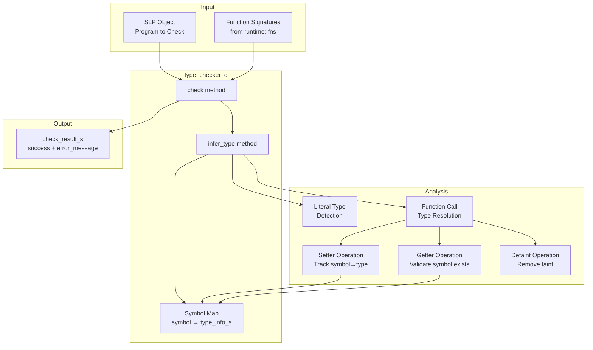
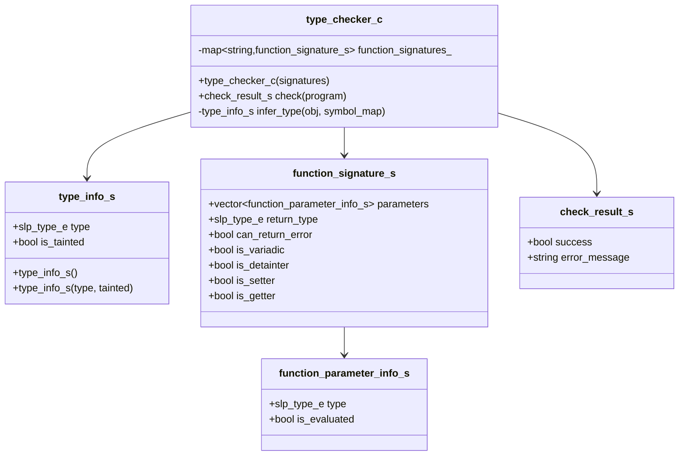
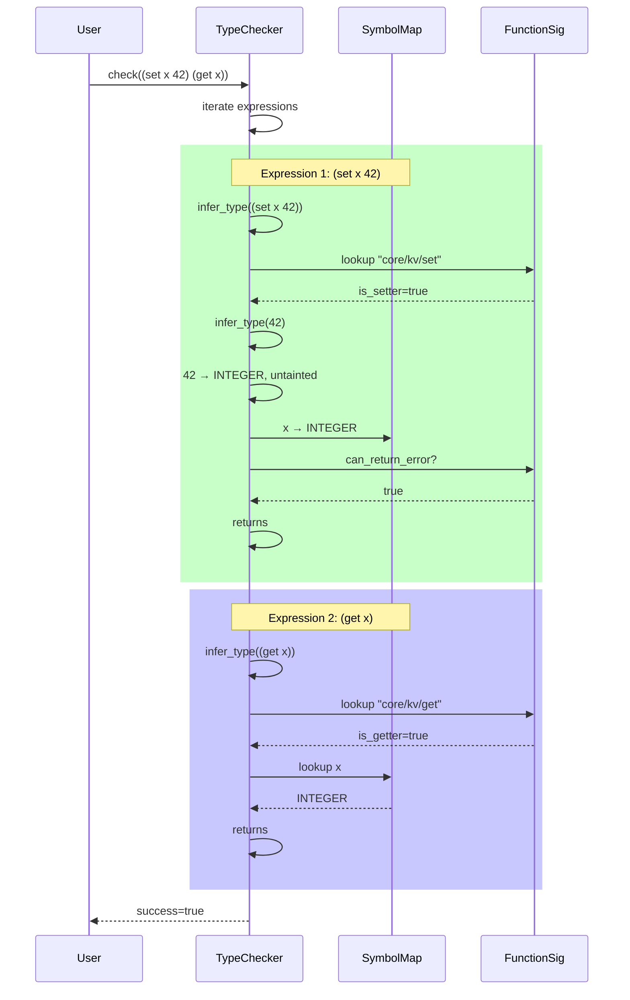
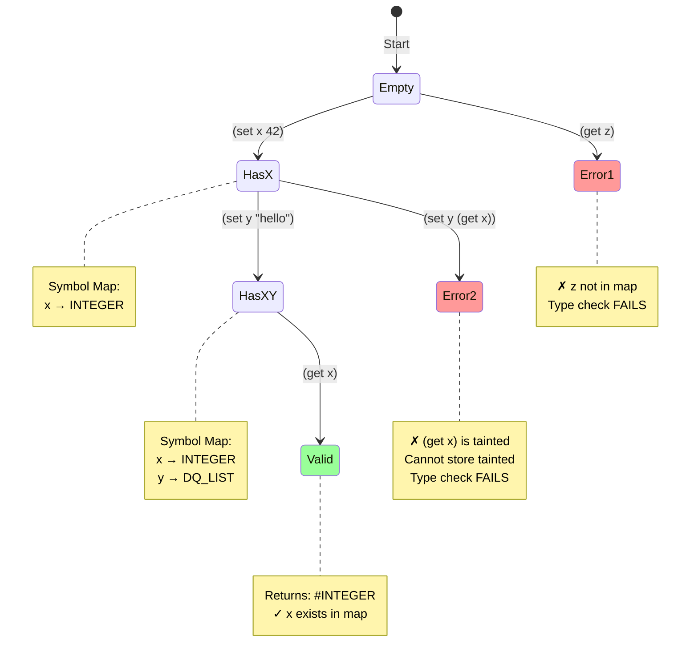
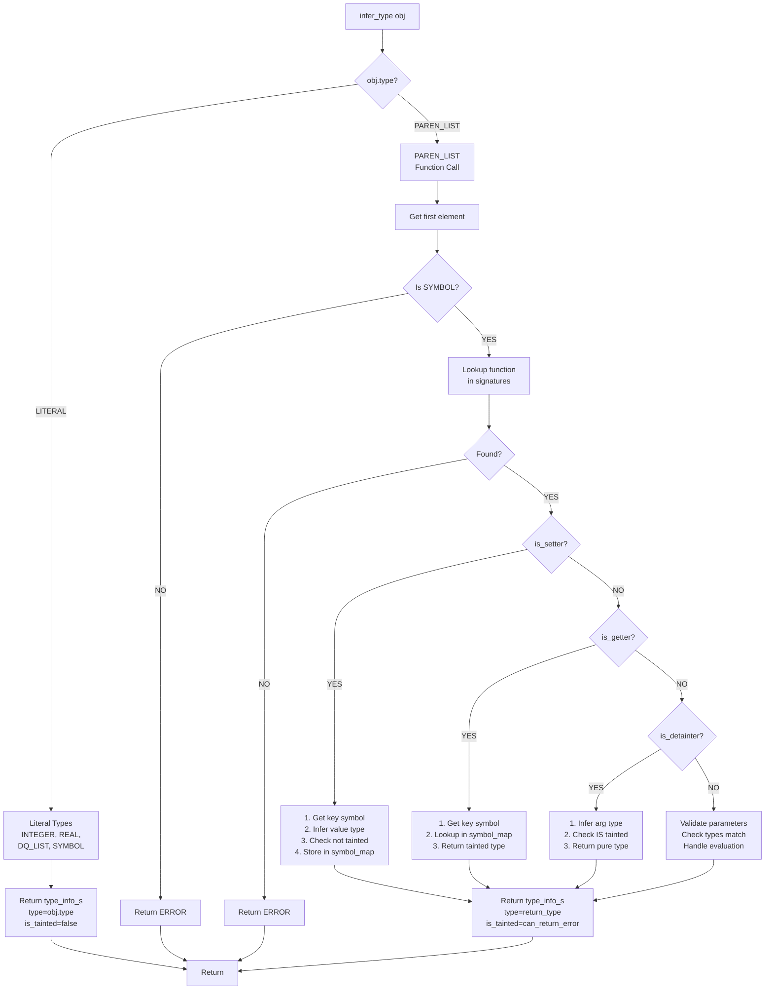

# Type System (TS)

The type system performs static analysis on SLP programs to ensure type safety before runtime execution.

## Architecture Overview



## Type Information Structure



## Type Flow Analysis



## Taint System

Types can be **pure** or **tainted**:

| State | Notation | Meaning | Example |
|-------|----------|---------|---------|
| Pure | `T` | Guaranteed to be type T | `INTEGER` from literal `42` |
| Tainted | `#T` | May be T OR ERROR | `#INTEGER` from `(core/kv/get x)` |

### Taint Rules

```mermaid
graph LR
    subgraph Sources
        LIT[Literals<br/>42, "hello"]
        PURE_FN[Pure Functions<br/>can_return_error=false]
    end
    
    subgraph "Tainted Sources"
        ERROR_FN[Error-prone Functions<br/>can_return_error=true]
    end
    
    subgraph Operations
        DETAINT[Detaint<br/>is_detainter=true]
        SETTER[Setter<br/>is_setter=true]
    end
    
    LIT -->|produces| PURE[Pure Type T]
    PURE_FN -->|produces| PURE
    ERROR_FN -->|produces| TAINT[Tainted Type #T]
    
    PURE -->|allowed| SETTER
    TAINT -->|blocked| SETTER
    TAINT -->|required| DETAINT
    DETAINT -->|produces| PURE
    
    style PURE fill:#9f9
    style TAINT fill:#f99
    style DETAINT fill:#99f
```

### Detaint Operation

The **detaint** operation (`core/insist` in tests) converts a tainted type to pure:

```
Input:  #T (tainted)
Output: T (pure)
```

If the input is ERROR at runtime, execution terminates. This is the primitive that higher-level error handling compiles down to.

## Setter/Getter Tracking



## Type Inference Algorithm



## Example: Complete Type Check

Given program: `((core/kv/set x 42) (core/kv/set y (core/insist (core/kv/get x))))`

```mermaid
graph TB
    subgraph "Initial State"
        SM0[Symbol Map: empty]
    end
    
    subgraph "Expression 1: (core/kv/set x 42)"
        E1[Lookup core/kv/set]
        E1_SET{is_setter?}
        E1_KEY[Extract key: x]
        E1_VAL[Infer value: 42]
        E1_TYPE[Type: INTEGER, pure]
        E1_STORE[Store x → INTEGER]
        E1_RET[Return: #SYMBOL]
    end
    
    subgraph "State After E1"
        SM1[Symbol Map:<br/>x → INTEGER]
    end
    
    subgraph "Expression 2: (core/kv/set y ...)"
        E2[Lookup core/kv/set]
        E2_SET{is_setter?}
        E2_KEY[Extract key: y]
        E2_VAL[Infer value:<br/>nested expression]
    end
    
    subgraph "Nested: (core/insist ...)"
        N1[Lookup core/insist]
        N1_DET{is_detainter?}
        N1_ARG[Infer arg:<br/>nested expression]
    end
    
    subgraph "Nested: (core/kv/get x)"
        N2[Lookup core/kv/get]
        N2_GET{is_getter?}
        N2_KEY[Extract key: x]
        N2_LOOKUP[Lookup x in map]
        N2_FOUND[Found: INTEGER]
        N2_RET[Return: #INTEGER]
    end
    
    subgraph "Back to core/insist"
        N1_CHECK{Input tainted?}
        N1_PURE[Remove taint]
        N1_RET[Return: INTEGER]
    end
    
    subgraph "Back to Expression 2"
        E2_CHECK{Value tainted?}
        E2_STORE[Store y → INTEGER]
        E2_RET[Return: #SYMBOL]
    end
    
    subgraph "Final State"
        SM2[Symbol Map:<br/>x → INTEGER<br/>y → INTEGER]
        RESULT[✓ SUCCESS]
    end
    
    SM0 --> E1
    E1 --> E1_SET
    E1_SET --> E1_KEY
    E1_KEY --> E1_VAL
    E1_VAL --> E1_TYPE
    E1_TYPE --> E1_STORE
    E1_STORE --> E1_RET
    E1_RET --> SM1
    
    SM1 --> E2
    E2 --> E2_SET
    E2_SET --> E2_KEY
    E2_KEY --> E2_VAL
    E2_VAL --> N1
    
    N1 --> N1_DET
    N1_DET --> N1_ARG
    N1_ARG --> N2
    
    N2 --> N2_GET
    N2_GET --> N2_KEY
    N2_KEY --> N2_LOOKUP
    N2_LOOKUP --> N2_FOUND
    N2_FOUND --> N2_RET
    
    N2_RET --> N1_CHECK
    N1_CHECK -->|YES| N1_PURE
    N1_PURE --> N1_RET
    
    N1_RET --> E2_CHECK
    E2_CHECK -->|NO| E2_STORE
    E2_STORE --> E2_RET
    
    E2_RET --> SM2
    SM2 --> RESULT
    
    style E1_STORE fill:#9f9
    style E2_STORE fill:#9f9
    style N2_RET fill:#ff9
    style N1_PURE fill:#99f
    style N1_RET fill:#9f9
    style RESULT fill:#9f9
```



## SLP Base Types

The type system works with the following SLP types:

| Type | Description | Example |
|------|-------------|---------|
| `INTEGER` | 64-bit signed integer | `42`, `-17` |
| `REAL` | Double-precision float | `3.14`, `-2.5` |
| `DQ_LIST` | String (double-quoted list of runes) | `"hello"` |
| `SYMBOL` | Unquoted identifier | `x`, `core/kv/set` |
| `PAREN_LIST` | Function call or grouping | `(f x y)` |
| `BRACKET_LIST` | Sequential execution block | `[a b c]` |
| `BRACE_LIST` | Handler body (unevaluated) | `{code}` |
| `SOME` | Quote-prefixed literal | `'x` |
| `ERROR` | Error value | `@"message"` |
| `NONE` | Empty/null value | - |
| `RUNE` | Single character (internal) | - |

## Key Concepts

### 1. No Variables
The type system doesn't track "variable types" in the traditional sense. Symbols are just keys. We track:
- **Which symbols have been used in setter operations** (symbol exists)
- **What type was stored at that symbol** (for getter return type inference)

### 2. Dataflow Analysis
The type checker processes expressions sequentially, maintaining a symbol→type map that grows as setters execute:

```
State 0: {}
(set x 42) → State 1: {x → INTEGER}
(set y "hello") → State 2: {x → INTEGER, y → DQ_LIST}
(get x) → Uses State 2, returns #INTEGER
```

### 3. Taint Propagation
Taint propagates through function calls. If a function `can_return_error`, its return type is tainted:

```
42                    → INTEGER (pure)
(core/kv/set x 42)    → #SYMBOL (tainted)
(core/kv/get x)       → #INTEGER (tainted)
(core/insist ...)     → INTEGER (detainted)
```

### 4. Generic Function Specification
Functions are marked with flags rather than hardcoded names:
- `is_setter` - stores symbol→type mapping
- `is_getter` - retrieves type from symbol→type mapping  
- `is_detainter` - removes taint from type
- `can_return_error` - return type is tainted

This makes the type system extensible for future functions without modifying the core type checker logic.

## Usage Example

```cpp
mock_runtime_info_c mock;
auto groups = get_all_function_groups(mock);
auto signatures = build_type_signatures(groups);

signatures["core/kv/set"].is_setter = true;
signatures["core/kv/get"].is_getter = true;
signatures["core/insist"].is_detainter = true;

type_checker_c checker(signatures);

auto parse_result = slp::parse("((core/kv/set x 42) (core/insist (core/kv/get x)))");
auto result = checker.check(parse_result.object());

if (result.success) {
    // Type check passed - safe to execute
} else {
    // Type error: result.error_message
}
```

